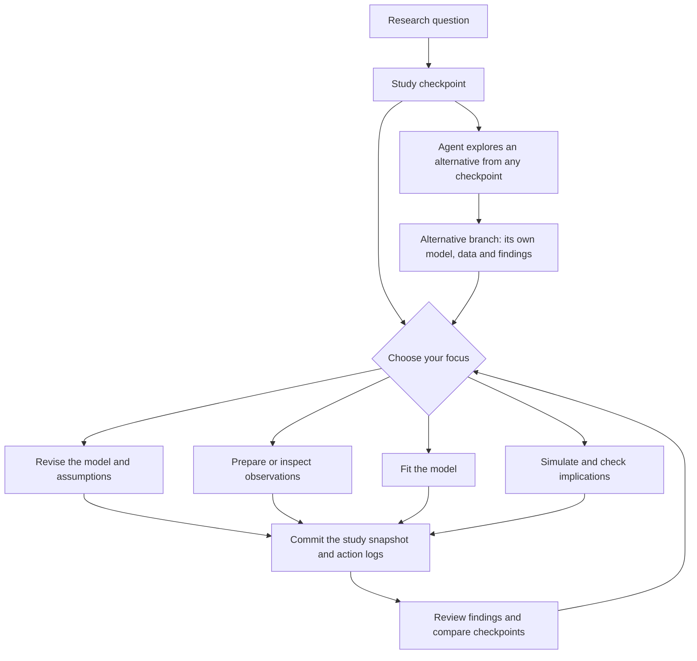

# Study history and workflow

A study has one local bare Git repository at `data/{workspace_id}/episode/history.git`. Git owns snapshots, commit ancestry and named branches. The [repository implementation](../../apps/data-pipeline/src/nof1_causal_lab/machine/history.py) uses [pygit2](https://www.pygit2.org/repository.html), with [reference transactions](https://www.pygit2.org/references.html) to publish an attempt and advance its branch. No remote or hosting service is required.

## Choose your focus

The agent chooses among the four [scientific actions](../reference/scientific-actions.md). Their input requirements determine availability. Each request explicitly selects the work to execute. Agent interactions create and continue alternatives through branch management.



Each successful action advances only its selected branch. A fork initially points to the same commit as its source, preserving the common question and all preceding work. Subsequent actions can change model assumptions, data selections or inference choices independently. Model input pins identify exact scientific inputs; Git parent commits describe study ancestry. Fitting a model selected from elsewhere is an explicit input selection, not an implicit branch operation.

## What a commit owns

| Tree path | Contents |
| --- | --- |
| `artifacts/{artifact_id}/` | Selected immutable artifact tree: its payload files and `meta.json` metadata |
| `artifacts/model/model.json` | The selected scientific definition, readable with `git show` and `git diff` |
| `checks.json` | Selected snapshot's typed model checks, policy/input keys and automatic predictive report |
| `logs/transition.json` | This attempt's action, status, recorded inputs, diagnostics and findings |
| `logs/events.json` | Runtime events captured during this attempt |
| `logs/traces/{subroutine_id}.json` | This attempt's finalized LLM traces |

Logs belong to the commit that produced them. A commit does not copy its ancestors' logs. Readers use Git's revision walker to find earlier evidence on the selected ancestry, so sibling-branch diagnostics cannot enter a snapshot merely because they have a lower sequence number. The [snapshot reader](../../apps/data-pipeline/src/nof1_causal_lab/machine/snapshots.py) reads a committed tree directly, without replaying a global journal.

Git assigns each artifact tree its content identity. Input pins use those tree OIDs; a `GitRef` identifies a study, Git object and path for either a scientific payload or an action log. There are no numbered artifact directories, version allocators, checkpoint manifests, or separately stored branch histories. Large arrays and tables live in content-addressed storage under `store/`; each artifact tree records its external table hashes. Back up the whole study directory, including `store/`, to retain numerical results alongside Git history.

`refs/heads/{branch}` selects scientific state. `refs/attempts/{seq}` retains each attempt's commit for audit and trace lookup. A rejected or failed attempt has its own log-bearing commit, based on the selected execution checkpoint, without advancing the branch. Sequence numbers label activity and identify workflow retries. Public historical reads and comparisons use commit OIDs. Live events and unfinished execution state remain in scratch until the commit captures the completed attempt's logs.

## Agent API

| Operation | API |
| --- | --- |
| Read a branch | `GET /api/episodes/{id}/model?branch=main` |
| Read an immutable checkpoint | `GET /api/episodes/{id}/model?at={commit_id}` |
| List branch names and head OIDs | `GET /api/episodes/{id}/branches` |
| Fork a complete checkpoint | `POST /api/episodes/{id}/branches` with `{"name":"alternative","at":"<commit_id>"}` |
| Act on a branch | `POST /api/episodes/{id}/actions?branch=alternative&expected_head={commit_id}` |
| Read an attempt's record | `GET /api/episodes/{id}/logs/{commit_id}` |
| Read its captured events | `GET /api/episodes/{id}/events?at={commit_id}` |
| Read its trace | `GET /api/episodes/{id}/traces/{commit_id}/{subroutine_id}` |

Agents manage branches through this API. The [workbench](../../apps/web/src/components/model/causal-model-asset.tsx) follows the latest committed work and presents the resulting history, using Git parent links and branch membership supplied by the server. Users inspect and compare checkpoints through the timeline; branch creation and naming stay in agent interactions.

Temporal serializes action execution per study. Before execution, an activity captures the selected branch's commit and snapshot. Publication checks that the branch still points to that commit. A conflicting result cannot replace newer state. Temporal coordinates jobs; Git is the durable authority for scientific history.

## Migrating existing local studies

Stop work on the study and close its existing episode workflow before migrating. Restart workers with the new code before submitting new actions; existing Temporal histories use the previous workflow activity sequence.

From the repository root:

```bash
uv run --project apps/data-pipeline python apps/data-pipeline/scripts/migrate_study_history.py data/STUDY
```

The [offline migration](../../apps/data-pipeline/scripts/migrate_study_history.py) converts numbered artifacts, journal records and traces into native Git trees and commits. It builds the repository separately and publishes it only after all records are converted. Original journal, trace and artifact files remain untouched. An earlier Git-format repository is retained as `history.before-objects.git`. Runtime readers use the new Git format exclusively. Older artifact schemas first require their corresponding [model migration](../guides/additive-model-migration.md). A fresh checkout of the tracked `DEMO` fixture uses its [Git bundle restoration](../guides/agentic_integration_testing.md#local-study-history).

Existing format-2 Git histories use the retired run/write records and actor labels.
Convert them into a separate format-3 repository with the [action-history converter](../../apps/data-pipeline/scripts/migrate_action_history.py):

```bash
uv run --project apps/data-pipeline python apps/data-pipeline/scripts/migrate_action_history.py \
  data/STUDY/episode/history.git data/STUDY/episode/history-actions.git
```

The converter preserves branches, failed attempts, scientific values, traces, and
input relationships. Removing actor metadata changes artifact and commit OIDs, so
it rewrites stored references and emits an old-to-new OID mapping. Archived
construct checks receive their target names from the retained model. Original
repositories remain untouched. Validate the replacement with the current readers,
retain the original as a backup, and replace `history.git` while the study is offline.
Start a fresh episode workflow seeded from the migrated Git state; do not replay
the previous workflow contract. Regenerate any fixture bundle from the new repository.

The initial implementation supports local branches and checkpoint comparison. Scientific model merging requires explicit reconciliation of assumptions and evidence; text merging alone is not a scientific merge policy.
