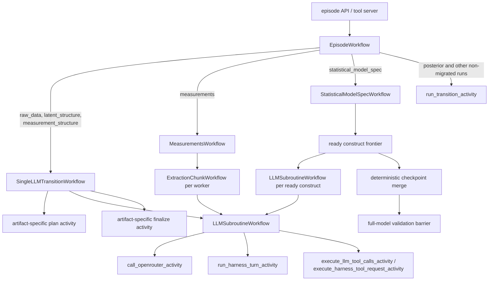

# Temporal LLM Orchestration

Status: **implemented**. The code paths are
[`machine/temporal/workflow.py`](../../apps/data-pipeline/src/nof1_causal_lab/machine/temporal/workflow.py),
[`machine/temporal/llm_transition_workflow.py`](../../apps/data-pipeline/src/nof1_causal_lab/machine/temporal/llm_transition_workflow.py),
[`machine/temporal/llm_subroutine_workflow.py`](../../apps/data-pipeline/src/nof1_causal_lab/machine/temporal/llm_subroutine_workflow.py),
and [`machine/temporal/worker.py`](../../apps/data-pipeline/src/nof1_causal_lab/machine/temporal/worker.py).

## Purpose

Temporal is the durable execution layer for moves that may take time, call LLMs, run tools, or need retry and resume semantics. The artifact machine still owns legality, staleness, provenance, and derivation cascades; Temporal owns the run history and activity scheduling.

This means "workflow", "activity", and "artifact transition" are intentionally different:

| Term | Meaning |
|---|---|
| Temporal workflow | Durable control flow visible in Temporal history |
| Temporal activity | A side-effecting or heavy operation scheduled by a workflow |
| Artifact transition | A machine move that produces one primary artifact |
| Derivation | Deterministic machine-maintained artifact recomputed inside a transition finalization path |

Derivations are not Temporal workflows. They are deterministic code reached from finalization activities through the derivation cascade, so Temporal sees the enclosing activity, while the artifact store records the derived artifact versions.

## Control Flow

[`EpisodeWorkflow`](../../apps/data-pipeline/src/nof1_causal_lab/machine/temporal/workflow.py) is the entity workflow for one workspace. It accepts proposed moves, validates them against the pure artifact machine, runs the selected transition path, applies returned `TransitionEffects`, and journals every applied, rejected, or raised move.

[`SingleLLMTransitionWorkflow`](../../apps/data-pipeline/src/nof1_causal_lab/machine/temporal/llm_transition_workflow.py) is the generic outer workflow for transitions whose shape is exactly: emit running, plan, run one LLM subroutine, finalize, emit completed or failed. It covers `raw_data`, `latent_structure`, and `measurement_structure`.

[`MeasurementsWorkflow`](../../apps/data-pipeline/src/nof1_causal_lab/machine/temporal/measurement_workflow.py) stays specialized because it batches extraction chunks, tracks worker progress, retries chunk workflows, and aggregates chunk results.

[`StatisticalModelSpecWorkflow`](../../apps/data-pipeline/src/nof1_causal_lab/machine/temporal/statistical_model_spec_workflow.py) stays specialized because it schedules each ready frontier concurrently, keeps feedback-component members sequential, merges immutable branch checkpoints, runs the full-model barrier, and emits construct-level telemetry.

[`LLMSubroutineWorkflow`](../../apps/data-pipeline/src/nof1_causal_lab/machine/temporal/llm_subroutine_workflow.py) is the generic LLM interaction workflow. It handles OpenRouter calls, Claude/Codex harness turns, tool loops, repair turns, trace finalization, and result references.

## Activities and Adapters

Artifact-specific activities still exist where the transition needs artifact-specific I/O:

| Activity kind | Responsibility |
|---|---|
| Plan activities | Read input artifacts and write a context sidecar for the LLM subroutine |
| Finalize activities | Read validated LLM results, write artifact versions, and trigger derivation cascades |
| LLM runtime activities | Append messages, call providers, execute tools, bridge harness tool requests, and write traces |

The LLM runtime is intentionally split from artifact adapters:

| Module | Responsibility |
|---|---|
| [`llm_subroutine_workflow.py`](../../apps/data-pipeline/src/nof1_causal_lab/machine/temporal/llm_subroutine_workflow.py) | Durable LLM control flow |
| [`llm_subroutine_activities.py`](../../apps/data-pipeline/src/nof1_causal_lab/machine/temporal/llm_subroutine_activities.py) | Temporal activity definitions for the generic runtime |
| [`llm_context_adapters.py`](../../apps/data-pipeline/src/nof1_causal_lab/machine/temporal/llm_context_adapters.py) | Convert a context kind into system/user messages and tool specs |
| [`llm_tool_adapters.py`](../../apps/data-pipeline/src/nof1_causal_lab/machine/temporal/llm_tool_adapters.py) | Execute artifact-specific tools and validators |
| [`llm_subroutine_storage.py`](../../apps/data-pipeline/src/nof1_causal_lab/machine/temporal/llm_subroutine_storage.py) | Persist conversations, tool results, traces, and harness state |

`execute_python` for raw-data ingestion is a local tool adapter. It runs in the local pipeline process, writes the latest DataFrame sidecar, and returns tool feedback to the LLM rather than creating a separate sandbox service.

## Visibility

Temporal shows the durable shape of the run:

| Visible node | What to inspect |
|---|---|
| `EpisodeWorkflow` | accepted move, child workflow choice, journal activity |
| `SingleLLMTransitionWorkflow` | plan, one LLM subroutine child, finalize |
| `MeasurementsWorkflow` | extraction fanout, worker progress, chunk retries |
| `StatisticalModelSpecWorkflow` | ready-frontier fanout, attempts, checkpoint joins, full-model barrier |
| `LLMSubroutineWorkflow` | provider calls, repair turns, tool execution, trace finalization |

Child workflows carry memos and static details for workspace id, sequence, artifact id, context kind, chunk id, construct name, attempt, and subroutine id where applicable. These are intentionally memos rather than custom Search Attributes so local and CI Temporal namespaces do not need pre-registered search-attribute schema.

Raw LLM conversations, provider call records, harness traces, and validated tool results are persisted under the workspace run sidecars. Temporal shows the activity and child-workflow history; the sidecars hold payloads that are too large or too domain-specific to keep only in Temporal history.

## Queues and Limits

The episode worker hosts deterministic workflow code and local activities. Provider calls run on the OpenRouter task queue, whose worker config applies `max_task_queue_activities_per_second` from `extraction_workers.max_rpm`. Claude, Codex, and Pi harness turns run on separate task queues without an application-level concurrency cap; Temporal can schedule every ready model-spec branch.

This gives visibility at the LLM-call level while keeping rate limiting and retry policy in Temporal worker configuration.
