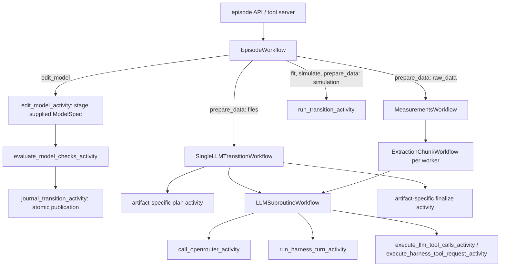

# Temporal LLM Orchestration

Status: **implemented**. The code paths are
[`machine/temporal/workflow.py`](../../apps/data-pipeline/src/nof1_causal_lab/machine/temporal/workflow.py),
[`machine/temporal/llm_transition_workflow.py`](../../apps/data-pipeline/src/nof1_causal_lab/machine/temporal/llm_transition_workflow.py),
[`machine/temporal/llm_subroutine_workflow.py`](../../apps/data-pipeline/src/nof1_causal_lab/machine/temporal/llm_subroutine_workflow.py),
and [`machine/temporal/worker.py`](../../apps/data-pipeline/src/nof1_causal_lab/machine/temporal/worker.py).

## Purpose

Temporal is the durable execution layer for actions that may take time, call LLMs, run tools, or need retry and resume semantics. The action executor owns revision validation and freshness; action-owned evaluators select checks. Temporal owns run history and activity scheduling.

This means "workflow", "activity", and "artifact transition" are intentionally different:

| Term | Meaning |
|---|---|
| Temporal workflow | Durable control flow visible in Temporal history |
| Temporal activity | A side-effecting or heavy operation scheduled by a workflow |
| Artifact transition | A private job that produces artifacts or recorded findings |
| Derivation | Scientific report refreshed by the action-owned evaluator when its inputs change |

Scientific checks use one `evaluate_model_checks_activity` after model staging, data preparation or fitting. A fixed evaluator selects affected checks by input fingerprints; there is no derivation scheduler. Predictive work runs for applicable edits and data preparation. The resulting reports publish atomically with the action.

## Control Flow

```mermaid
flowchart TB
    API["episode API / tool server"] --> EP["EpisodeWorkflow"]

    EP -->|"edit_model"| EDIT["edit_model_activity: stage supplied ModelSpec"]
    EDIT --> CHECK["evaluate_model_checks_activity"]
    CHECK --> SAVE["journal_transition_activity: atomic publication"]
    EP -->|"prepare_data: files"| S["SingleLLMTransitionWorkflow"]
    EP -->|"prepare_data: raw_data"| M["MeasurementsWorkflow"]
    EP -->|"fit, simulate, prepare_data: simulation"| RTA["run_transition_activity"]

    S --> PLAN["artifact-specific plan activity"]
    S --> LLM["LLMSubroutineWorkflow"]
    S --> FINAL["artifact-specific finalize activity"]

    M --> CHUNK["ExtractionChunkWorkflow per worker"]
    CHUNK --> LLM

    LLM --> OR["call_openrouter_activity"]
    LLM --> H["run_harness_turn_activity"]
    LLM --> T["execute_llm_tool_calls_activity /\nexecute_harness_tool_request_activity"]
```

[`EpisodeWorkflow`](../../apps/data-pipeline/src/nof1_causal_lab/machine/temporal/workflow.py) is the entity workflow for one workspace. It accepts the four typed scientific requests through `execute_action`, checks branch and model revisions, executes the requested action, applies returned `TransitionEffects`, and journals every applied, rejected, or raised attempt.

[`SingleLLMTransitionWorkflow`](../../apps/data-pipeline/src/nof1_causal_lab/machine/temporal/llm_transition_workflow.py) is the generic outer workflow for transitions whose shape is exactly: emit running, plan, run one LLM subroutine, finalize, emit completed or failed. The episode dispatches it for `prepare_data` with `source: "files"`. Model authoring is performed by the external agent through `edit_model`.

[`MeasurementsWorkflow`](../../apps/data-pipeline/src/nof1_causal_lab/machine/temporal/measurement_workflow.py) stays specialized because it batches extraction chunks, tracks worker progress, retries chunk workflows, and aggregates chunk results.

[`evaluate_model_checks_activity`](../../apps/data-pipeline/src/nof1_causal_lab/machine/temporal/activities.py) runs the shared check evaluator in a worker thread. Its dedicated queue keeps long JAX compilation and simulation work outside the episode workflow and ingestion activities. There are no construct frontiers, admission checkpoints or full-model repair barriers.

[`LLMSubroutineWorkflow`](../../apps/data-pipeline/src/nof1_causal_lab/machine/temporal/llm_subroutine_workflow.py) is the generic LLM interaction workflow. It handles OpenRouter calls, Claude/Codex harness turns, tool loops, repair turns, trace finalization, and result references.

## Activities and Adapters

Artifact-specific activities still exist where the transition needs artifact-specific I/O:

| Activity kind | Responsibility |
|---|---|
| Plan activities | Read input artifacts and write a context sidecar for the LLM subroutine |
| Finalize activities | Read validated LLM results, stage artifact versions for the owning action's checks and publication |
| LLM runtime activities | Append messages, call providers, execute tools, bridge harness tool requests, and write traces |

The LLM runtime is intentionally split from artifact adapters:

| Module | Responsibility |
|---|---|
| [`llm_subroutine_workflow.py`](../../apps/data-pipeline/src/nof1_causal_lab/machine/temporal/llm_subroutine_workflow.py) | Durable LLM control flow |
| [`llm_subroutine_activities.py`](../../apps/data-pipeline/src/nof1_causal_lab/machine/temporal/llm_subroutine_activities.py) | Temporal activity definitions for the generic runtime |
| [`llm_context_adapters.py`](../../apps/data-pipeline/src/nof1_causal_lab/machine/temporal/llm_context_adapters.py) | Convert a context kind into system/user messages and tool specs |
| [`llm_tool_adapters.py`](../../apps/data-pipeline/src/nof1_causal_lab/machine/temporal/llm_tool_adapters.py) | Execute artifact-specific tools and validators |
| [`llm_subroutine_storage.py`](../../apps/data-pipeline/src/nof1_causal_lab/machine/temporal/llm_subroutine_storage.py) | Persist conversations, tool results, traces, and harness state |

`execute_python` for raw-data ingestion is a local tool adapter. It runs in the local pipeline process, writes the latest DataFrame sidecar, and returns tool feedback to the LLM rather than creating a separate sandbox service.

## Visibility

Temporal shows the durable shape of the run:

| Visible node | What to inspect |
|---|---|
| `EpisodeWorkflow` | accepted action, child workflow choice, journal activity |
| `SingleLLMTransitionWorkflow` | plan, one LLM subroutine child, finalize |
| `MeasurementsWorkflow` | extraction fanout, worker progress, chunk retries |
| `evaluate_model_checks_activity` | affected specification, identification, profile, compatibility and predictive checks |
| `LLMSubroutineWorkflow` | provider calls, repair turns, tool execution, trace finalization |

Child workflows carry memos and static details for workspace id, sequence, artifact id, context kind, chunk id, attempt, and subroutine id where applicable. These are intentionally memos rather than custom Search Attributes so local and CI Temporal namespaces do not need pre-registered search-attribute schema.

Raw LLM conversations, provider call records, harness traces, and validated tool results are persisted under the workspace run sidecars. Temporal shows the activity and child-workflow history; the sidecars hold payloads that are too large or too domain-specific to keep only in Temporal history.

## Queues and Limits

The episode worker hosts deterministic workflow code and local activities. Provider calls run on the OpenRouter task queue, whose worker config applies `max_task_queue_activities_per_second` from `extraction_workers.max_rpm`. Claude, Codex, and Pi harness turns run on separate task queues without an application-level concurrency cap; These serve ingestion and extraction subroutines.

This gives visibility at the LLM-call level while keeping rate limiting and retry policy in Temporal worker configuration.

Automatic checks run on `nof1-model-checks` (overridden by `TEMPORAL_MODEL_CHECKS_TASK_QUEUE`), with one concurrent activity per worker and a one-hour action check timeout. The ordinary edit staging activity retains its shorter timeout. Scientific findings are returned as reports; unexpected execution failures follow the action failure and retry policy.
