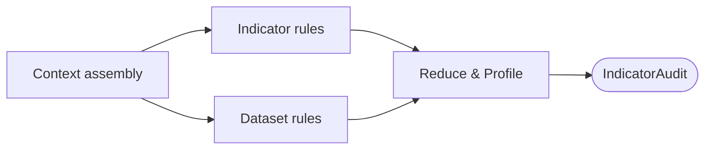

# Extraction Validation

| Modality | Interactive | Produces |
|---|---|---|
| Computed | No | `IndicatorAudit` per indicator, dataset-level issues |

Audits [`measurements` transition](extraction.md) observations against the [`measurement_structure` transition `CausalDesign`](measurement-structure.md#causaldesign), then computes an [empirical profile](#empiricalprofile) for each indicator that [`statistical_model_spec` transition](statistical-model-spec.md) uses to ground prior elicitation.

## Inputs

| Input | Source | Description |
|---|---|---|
| `causal_design` | [`measurement_structure` transition](measurement-structure.md) | [`CausalDesign`](measurement-structure.md#causaldesign) with indicator and construct metadata, `model_clock` |
| `data_for_model` | [`measurements` transition](extraction.md) | Encoded long-format [`ObservationRecord`](extraction.md#observationrecord) table |

## Process

`validation_report` derivation runs a fixed set of deterministic validation rules (no LLM involved) over the persisted `measurements` transition [`ObservationRecord`](extraction.md#observationrecord) table, reduces the findings into per-indicator statuses, computes empirical profiles, and packages everything into an `IndicatorAudit` per indicator.

**Context assembly:** Parses the [`model_clock`](measurement-structure.md#observation_window-and-model_clock) from the [`CausalDesign`](measurement-structure.md#causaldesign) into hours, builds lookup tables for indicator and construct metadata, and validates the table loaded from `measurements` transition. For each indicator it pre-computes an `IndicatorContext`: the numeric `Float64` series after coercion and null removal, observation count, variance, declared `measurement_dtype`, whether the parent construct is time-invariant, and a parsed timestamp series.

**Indicator rules:** Nine rules run in sequence for each indicator. Each rule receives the indicator's data and context and returns zero or more `ValidationIssue`s:

| Rule | Checks | Severity | Threshold |
|---|---|---|---|
| `missing` | Indicator declared in `CausalDesign` but absent from extracted data | warning | any absence |
| `no_numeric` | Rows exist but no values survived `Float64` coercion | error | zero numeric values |
| `timestamps` | Observation-time parsing | error if 100% invalid; warning if >50% | fraction of `anchor_time` values that fail all ten timestamp formats |
| `sample_size` | Minimum observation count | warning | < 10 observations |
| `variance` | Zero-variance detection | error | variance = 0 (constant series) |
| `dtype_range` | Values conform to declared [`measurement_dtype`](measurement-structure.md#indicator) | error for binary/count violations; warning for continuous outliers | see dtype-range details below |
| `time_coverage` | Data span relative to model clock | warning | time span < 10 × `model_clock` hours; skipped for time-invariant constructs |
| `timestamp_gaps` | Largest consecutive gap | warning | max gap > 5 × `model_clock` hours; skipped for time-invariant constructs |
| `hallucination_signals` | Patterns suspicious of LLM fabrication: dominant duplicate values (non-binary, non-count) and perfect arithmetic sequences | warning | >50% duplicate concentration, or all sorted diffs identical with non-zero step (≥5 observations) |

The `dtype_range` rule applies different logic per declared type:

- *Binary:* any value not in {0, 1} is an error.
- *Count:* negative values or values more than 1e-6 from their nearest integer are errors (matching the tolerance used at SSM build time).
- *Continuous:* with ≥10 observations, values beyond Q1 − 3·IQR or Q3 + 3·IQR are reported as outlier warnings.

**Dataset rules:** One dataset-level rule runs after all indicators:

| Rule | Checks | Severity |
|---|---|---|
| `construct_correlations` | For constructs with ≥2 indicators, daily-aggregated Pearson correlation between every indicator pair; negative correlation violates the [reflective measurement assumption](../reference/measurement-structure/assumptions.md#a1-reflective-measurement-structure) | warning (when r < 0, with ≥10 aligned days) |

**Reduce & Profile:** A central reducer aggregates per-indicator findings into two structures: a flat issue list and a health-metrics map keyed by indicator name. For each metric key, the worst severity among matching issues determines the cell status (`ok`, `warning`, or `error`). Rules own threshold logic; the reducer only aggregates.

From the same encoded [`ObservationRecord`](extraction.md#observationrecord) table, the transition computes an [`EmpiricalProfile`](#empiricalprofile) for each indicator. Each indicator's profile and validation findings are packaged into an `IndicatorAudit`.

### Example

For a study tracking developer productivity where `measurements` transition extracted indicators "lines of code per day" (continuous), "number of PR reviews" (count), and "burnout self-report" (ordinal), `validation_report` derivation might flag "lines of code per day" with a `suspicious_pattern` warning if >50% of extracted values are identical (suggesting the LLM hallucinated a constant), report `insufficient_coverage` on "burnout self-report" if the self-report survey data spans only 3 weeks against a `model_clock` of `"1d"`, and surface a `low_construct_correlation` warning if daily-aggregated "lines of code per day" and "number of PR reviews" correlate negatively despite both measuring the same construct.

## Outputs

| Output | Type | Description |
|---|---|---|
| `is_valid` | `bool` | `true` if no error-severity issues exist across all indicators and dataset checks |
| `indicators` | `dict[IndicatorId, IndicatorAudit]` | Keyed by persistent indicator ID; each entry bundles the [empirical profile](#empiricalprofile) and validation findings |
| `dataset_issues` | `list[ValidationIssue]` | Issues not attributable to a single indicator (e.g., negative cross-indicator correlations) |

### `ValidationIssue`

| Field | Type | Description |
|---|---|---|
| `subject` | `EntityRef` ∣ `null` | Explicit indicator or construct owner; null for a dataset-wide issue |
| `severity` | `str` | Issue severity |
| `issue_type` | `str` | Validation rule identifier |
| `message` | `str` | Explanation of the finding |

### `EmpiricalProfile`

| Field | Type | Description |
|---|---|---|
| `measurement_dtype` | `str` ∣ `null` | Declared dtype from the [`CausalDesign`](measurement-structure.md#causaldesign) (`"binary"`, `"count"`, `"continuous"`, or `"ordinal"`) |
| `n_obs` | `int` | Number of non-null numeric observations |
| `mean` | `float` ∣ `null` | Arithmetic mean |
| `std` | `float` ∣ `null` | Standard deviation |
| `min` | `float` ∣ `null` | Minimum value |
| `max` | `float` ∣ `null` | Maximum value |
| `q25` | `float` ∣ `null` | 25th percentile |
| `q50` | `float` ∣ `null` | Median |
| `q75` | `float` ∣ `null` | 75th percentile |
| `variance` | `float` ∣ `null` | Sample variance |
| `time_coverage_ratio` | `float` ∣ `null` | Observed time span divided by the `time_coverage` rule threshold; capped at 1.0. `null` for fewer than 2 timestamps or time-invariant constructs |
| `max_gap_ratio` | `float` ∣ `null` | Largest consecutive gap divided by the `timestamp_gaps` rule threshold. `null` for fewer than 3 timestamps or time-invariant constructs |
| `dtype_violations` | `int` ∣ `null` | Count of values that violate the declared `measurement_dtype` constraints |
| `duplicate_pct` | `float` ∣ `null` | Fraction of observations equal to the single most common value |
| `arithmetic_sequence_detected` | `bool` | `true` if all sorted consecutive differences are identical with non-zero step (≥5 observations) |
| `n_unparseable_timestamps` | `int` ∣ `null` | Count of `anchor_time` values that failed all timestamp format patterns |
| `zero_fraction` | `float` ∣ `null` | Fraction of observations that are exactly zero |
| `is_nonnegative` | `bool` ∣ `null` | `true` if minimum ≥ 0 |
| `is_unit_interval` | `bool` ∣ `null` | `true` if all values fall in [0, 1] |
| `looks_integer_valued` | `bool` ∣ `null` | `true` if every value is within 1e-8 of its nearest integer |
| `variance_to_mean_ratio` | `float` ∣ `null` | Variance / mean (index of dispersion); `null` when mean ≤ 0 |
