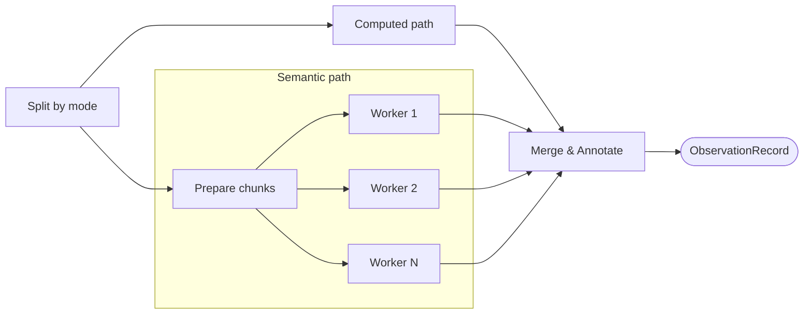

# Indicator Extraction

| Modality | Interactive | Produces |
|---|---|---|
| Hybrid | No | [`ObservationRecord`](#observationrecord) table |

Materializes numeric indicator values from raw data by routing each indicator through a deterministic or LLM-mediated extraction path, then annotating the results with support-window metadata.

## Inputs

| Input | Source | Description |
|---|---|---|
| `raw_data` | [`raw_data` transition](ingestion.md#outputs) | Ingested Arrow table, converted to Polars for extraction computations |
| `model` | [`measurement_structure` transition](measurement-structure.md) | [`ModelSpec`](latent-structure.md#modelspec) with its research question, indicators, and extraction modes |

`measurement_structure` transition specified *what* to measure and *how*; `measurements` transition carries out those instructions against the raw data. This is the first point where indicator definitions are evaluated over actual values.

## Process

Indicators are split by [`extraction_mode`](measurement-structure.md#indicatorspec) and processed concurrently.

Both paths begin by [truncating the raw time column to each indicator's observation window](measurement-structure.md#observation_window-and-measurement_clock), then materializing every support-window bucket between the first and last observed tick, including buckets with no raw rows. They diverge in how values are extracted from each bucket.

**Computed path:** The indicator's aggregation function is applied within each window group via Polars. Computed rules—multi-column expressions specified as an AST—are compiled into Polars expressions and evaluated within the same groups. Windows with no raw rows emit `null`; count aggregations emit `0` only when raw rows are present and the counted source or condition is absent.

**Semantic path:** Indicators with `extraction_mode="semantic"` require LLM interpretation and follow a prepare-then-fan-out pattern.

*Prepare chunks:* Semantic indicators are grouped by observation window, the raw DataFrame is projected to only the `source_columns` referenced by those indicators, chunked into batches, and formatted as LLM-readable markdown showing timestamped events within each window. Events are truncated per window when they exceed a configurable cap, preserving the first and last events with uniform sampling in between.

*Fan-out:* Each chunk is dispatched to a parallel LLM worker via Prefect's `.map()`, respecting configurable concurrency and rate limits. The worker receives the formatted window text, the research question, and the indicator definitions (name, dtype, summary operator, support kind, window, and `how_to_measure` instructions). It interprets events against those instructions and submits its extractions via a `validate_extractions` tool call. The validation tool checks:

- *Indicator names* exist in the `ModelSpec`
- *Support-window starts* match the expected boundaries for this chunk
- *Dtype conformance:* extracted values match the indicator's `measurement_dtype` (continuous, binary, count, ordinal, categorical)
- *No duplicate `(window_start, indicator)` pairs* within the chunk
- *Ordinal bounds:* ordinal codes fall within `0..len(ordinal_levels) − 1`

**Merge & Annotate:** Both paths emit raw `(indicator_id, value, timestamp)` tuples where `timestamp` is the support-window start. The annotation step joins these rows with indicator metadata from the `ModelSpec` to produce the canonical [`ObservationRecord`](#observationrecord).

### Example

For a study of classroom interventions and student learning where `measurement_structure` transition defined computed indicators like "mean daily attendance rate" (`computed`, continuous, `mean`, `1w`) and semantic indicators like "teacher-reported engagement level" (`semantic`, ordinal, `last`, `1w`), `measurements` transition would aggregate attendance records via Polars into weekly means while dispatching weekly narrative logs to LLM workers that extract ordinal engagement codes.

## Outputs

| Output | Type | Description |
|---|---|---|
| `panel` | [`ObservationRecord`](#observationrecord) table | Numerically encoded observations persisted as Parquet for downstream fitting |

The panel is the only persisted scientific output. Final worker outcomes and counts are retained in the [transition journal](../guides/agentic_integration_testing.md#workspace-layout). The measurement view reads panel counts and sample rows directly.

A completed extraction with no observations records its outcome in the journal and retracts any previous panel and its validation report. Automatic execution stops for those inputs; fitting remains unavailable until observations exist. Changes to extraction inputs make the operation eligible again.

### `ObservationRecord`

| Field | Type | Description |
|---|---|---|
| `indicator_id` | `IndicatorId` | Persistent indicator ID, referencing the [measurement structure](measurement-structure.md#model-measurement-choices) |
| `value` | `Float64` | Extracted value (numerically encoded; non-continuous types label-encoded) |
| `anchor_time` | `datetime` | Latent-grid attachment time—the timestamp downstream models use for this observation |
| `support_kind` | `"point"` \| `"interval"` | Whether the measurement is point-local (`first`/`last`) or an interval summary (`sum`/`count`/`mean`/`std`) |
| `summary_operator` | `str` | The aggregation applied within the support window |
| `anchor_policy` | `"support_start"` \| `"support_end"` | Which support boundary `anchor_time` corresponds to |
| `observation_window` | `str` | The window width (e.g. `"1d"`, `"1w"`) over which the value was measured or aggregated |
| `support_start` | `datetime` | Start of the realized support window |
| `support_end` | `datetime` | End of the realized support window (`support_start` + `observation_window`) |

`support_kind`, `summary_operator`, and `anchor_policy` are [derived deterministically](measurement-structure.md#derived-observation-semantics) from the measurement structure; they are not free parameters.
