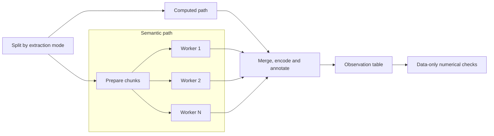

# Data preparation and indicator extraction

| Modality | Interactive | Produces |
| --- | --- | --- |
| Hybrid | No | Observations, preparation metadata and a numerical data profile |

[`prepare_data`](../reference/scientific-actions.md#preparing-uploaded-files) produces a dataset without reading a causal model. Uploaded files go through ingestion and the existing computed/semantic extraction workflow. A recorded simulation replicate already has numeric observations and a schema, so it skips extraction. Both branches run the same numerical data checks; the [action flowchart](../reference/action-flows.md#prepare_data) shows their shared boundary.

## Inputs

| Input | Description |
| --- | --- |
| `source.files` | Explicit uploaded filenames. Ingestion produces the internal [raw table](ingestion.md#outputs) consumed by extraction in the same action. |
| `preparation` | [`DataPreparationSpec`](#datapreparationspec), required for files. Defines the observations independently of a model. |
| `max_windows` | Optional limit retaining the newest extraction windows. |
| `source.revision`, `source.replicate` | Alternative source: the commit of an applied `simulate` action and one zero-based replicate. Uses its recorded observation schema and support layout; no preparation spec or extraction limit. |

### `DataPreparationSpec`

The [preparation contract](../../apps/data-pipeline/src/nof1_causal_lab/artifacts/data_preparation.py) is supplied in the action and versioned with its output. It has no separate editing or admission workflow.

| Field | Description |
| --- | --- |
| `default_window` | Positive duration used by variables without their own window. |
| `context` | Optional context for interpreting the uploaded data. |
| `variables` | Stable IDs, names, dtypes, aggregation, optional window overrides and ordinal/categorical codebooks, plus the extraction fields below. |
| `variables[].how_to_measure` | Scoring rubric, including rules for interpreting a diary or other semantic source. |
| `variables[].source_columns` | Raw columns referenced by the instructions or computed expression. |
| `variables[].extraction_mode` | `computed` for deterministic extraction or `semantic` for interpretation by workers. |
| `variables[].computed_rule` | Optional validated window expression over declared source columns. |
| `variables[].recording` | `samples`, `events` or `changes`, determining missing-window behavior. |

A model indicator retains its generative observation definition and likelihood. It refers to a prepared variable by the same stable ID. Model/data compatibility checks compare dtype, aggregation, codebooks and resolved window; preparation never needs constructs, priors or likelihoods.

## Process

Variables are split by extraction mode and processed concurrently by the [measurement workflow](../../apps/data-pipeline/src/nof1_causal_lab/machine/temporal/measurement_workflow.py).

```mermaid
flowchart LR
    S[Split by extraction mode] --> C[Computed path] & P[Prepare chunks]
    P --> W1[Worker 1] & W2[Worker 2] & Wn[Worker N]
    C --> M[Merge, encode and annotate]
    W1 & W2 & Wn --> M
    M --> O[Observation table] --> D[Data-only numerical checks]
    subgraph Semantic path
        P
        W1
        W2
        Wn
    end
```

Both paths partition the raw time column by each variable's resolved observation window. They materialize support-window buckets between the first and last observed ticks, including windows with no raw rows.

**Computed path:** Polars applies the declared aggregation or validated computed expression within each window. With `recording="samples"`, empty windows remain missing. Event streams use zero for empty count/sum windows; change streams carry the last recorded value forward. The [aggregation implementation](../../apps/data-pipeline/src/nof1_causal_lab/utils/aggregations.py) owns these rules.

**Semantic path:** Variables are grouped by observation window, the raw table is projected to their source columns, and windows are chunked into worker inputs. Configurable event caps preserve first and last events with uniform sampling between them. Temporal dispatches the existing parallel workers with bounded concurrency and retries. Each receives the preparation context, scoring instructions, expected windows, dtypes and declared codebooks. The [worker validator](../../apps/data-pipeline/src/nof1_causal_lab/workers/schemas.py) checks variable identity, window boundaries, dtype, discrete levels and duplicate window/variable pairs. Partial worker completion remains visible in the action's extraction diagnostics and traces.

**Merge and annotate:** The [materializer](../../apps/data-pipeline/src/nof1_causal_lab/flows/transitions/extraction/materialization.py) combines computed and semantic rows, encodes discrete observations against the declared codebook and annotates support metadata from the preparation definition. Missing categories do not renumber the remaining categories.

**Simulation source:** The [replicate materializer](../../apps/data-pipeline/src/nof1_causal_lab/actions/prepare_data.py) copies only the selected draw's emitted observations, preserving numeric codes, missingness and actual support windows from the recorded layout. It uses a synthetic UTC origin of 1970-01-01 for model days. It neither generates again nor pools draws; latent paths and true parameter draws remain in the source simulation report.

**Numerical checks:** Both branches produce the [data profile](extraction-validation.md#dataprofileartifact) with missingness, timestamps, sample size, variance, dtype/codebook bounds, coverage, gaps and pattern warnings. These [checks](../reference/model-checks.md#prepare-data) use the dataset's own definitions. Likelihood support, construct correlations, standardization and prior reach belong to model/data compatibility in `edit_model` and fit preflight.

## Outputs

| Output | Description |
| --- | --- |
| `panel.parquet` | [`ObservationRecord`](#observationrecord) rows for downstream fitting and comparisons. |
| `metadata.json` | [`PreparedDataMetadata`](#prepareddatametadata), stored in the same immutable panel artifact. |
| `data_profile` | [Numerical data report](extraction-validation.md#dataprofileartifact), pinned to the panel revision. |

The source table, observations, metadata, profile and action logs publish together. Preparation requires usable observations; an unsuccessful action does not replace the current dataset. Partial extraction and data-quality findings can accompany a saved result through timestamped labels, with details in the typed reports. Later preparations preserve earlier evidence and its original data references.

### `PreparedDataMetadata`

| Field | Description |
| --- | --- |
| `source` | Uploaded filenames, or the exact simulation commit and replicate. |
| `variables` | Data-owned observation schema: IDs, names, dtypes, aggregation, resolved windows and codebooks. |
| `preparation` | Full instructions for files; absent for simulation observations whose definitions were already recorded. |

### `ObservationRecord`

| Field | Description |
| --- | --- |
| `indicator_id` | Persistent observation identity, declared in this dataset's metadata. A model may bind an indicator with the same ID. |
| `value` | Numeric observation; discrete codes follow the declared levels. Missingness remains explicit. |
| `anchor_time` | Latent-grid attachment time used by downstream models. |
| `support_kind` | `point` or `interval`, derived from the summary operator. |
| `summary_operator` | The declared summary, such as `last`, `mean` or `sum`. |
| `anchor_policy` | `support_start` or `support_end`, derived from the summary operator. |
| `observation_window` | Resolved positive duration. |
| `support_start` | Start of the realized support window. |
| `support_end` | End of the realized support window. |

Support kind and anchor policy are [derived deterministically](../../apps/data-pipeline/src/nof1_causal_lab/utils/observation_semantics.py) from the observation definition. They are not independently chosen extraction fields.
