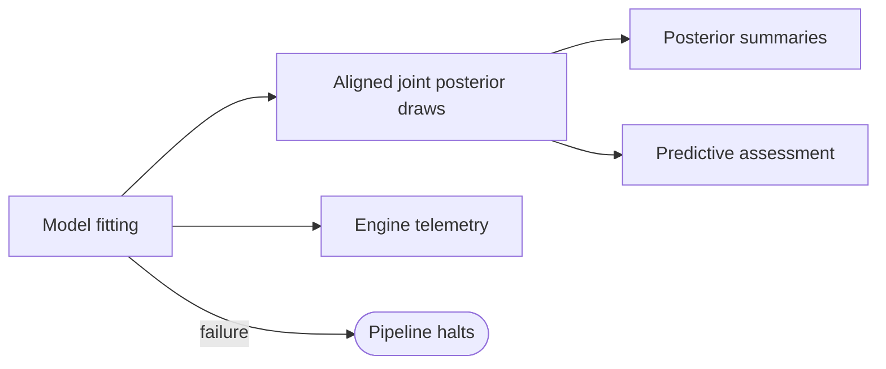

# Posterior Inference

| Modality | Interactive | Produces |
|---|---|---|
| Computed | No | A new `ModelSpec` revision with joint uncertainty; an [inference report](#inferencereport) in the transition log |

Conditions the scientific `ModelSpec` from [`statistical_model_spec` transition](statistical-model-spec.md) to the extracted observation data from [`measurements` transition](extraction.md), retaining aligned parameter and latent-state draws. Engine-defined JSON records inference diagnostics; a separate structured assessment records posterior predictive fit and leave-one-out cross-validation. The sampler is `marginal_particle_gibbs`; its proposal controls are described in [inference routing](../reference/inference-routing.md#user-overrides).

## Inputs

| Input | Source | Description |
|---|---|---|
| `model` | [`statistical_model_spec` transition](statistical-model-spec.md) | Scientific components and their current parameter distributions |
| `data_for_model` | [`measurements` transition](extraction.md) | Encoded long-format [`ObservationRecord`](extraction.md#observationrecord) table |
| `inference_method` | Pipeline config | Optional explicit `"marginal_particle_gibbs"`; `null` uses the same [production route](../reference/inference-routing.md#structural-routing) |

`statistical_model_spec` transition provided the compiled model and priors; `posterior` transition is where that model is fitted to data and the posterior is characterized.

## Process

`posterior` is a computed operation with no LLM. It produces a new revision of the same `ModelSpec`, replacing its uncertainty with the joint posterior. Parameter and construct references share one native NumPyro law, preserving dependence between parameters and latent trajectories. The report and engine evidence live in the transition log. An explicit refit starts from the original input revision so the same observations are counted once.

**Model fitting:** The transition resolves the [production route](../reference/inference-routing.md#structural-routing) and runs marginalized Particle Gibbs with the configured proposal controls. Dynestyx supplies the model interpretation and shared transition and target densities. The app owns the corrected joint particle kernel, conditional dSMC, chain execution, adaptation, and diagnostics, alongside scientific metadata, initialization policy, causal gates, and reporting. The Dynestyx revision is pinned in the [pipeline dependency configuration](../../apps/data-pipeline/pyproject.toml); Cuthbert remains a transitive package dependency of Dynestyx and is not used by the app's sampler. Profiling uses the sampler's `profile_dir` option or `NOF1_PROFILE_DIR`.

The [scientific-model compiler](../../apps/data-pipeline/src/nof1_causal_lab/models/ssm/execution/dynamical_model.py) declares a Dynestyx model with the causal drift, initial distribution, and heterogeneous observation law. The [particle adapter](../../apps/data-pipeline/src/nof1_causal_lab/models/ssm/inference/problem.py) carries that model's array parameters directly and selects Euler–Maruyama transitions over the true nonlinear drift. Particle inference and initialization share NumPyro's replayed parameter transforms, conditional priors, and factors. Gaussian local approximations are confined to the [initialization adapter](../../apps/data-pipeline/src/nof1_causal_lab/models/ssm/inference/targets/transitions.py).

Inference and prior prediction share the same [parameter assembly](../../apps/data-pipeline/src/nof1_causal_lab/models/ssm/execution/parameters.py): declared free sites supply block values, including the initial covariance and static-factor contribution. The NumPyro model retains the covariance constraint factor. Prior prediction draws directly from the compiled distributions using stable per-site random streams.

Prior and posterior prediction construct the same Dynestyx model as inference, sample its initial distribution, and execute its declared nonlinear drift, node potentials, and diffusion. The [observation adapter](../../apps/data-pipeline/src/nof1_causal_lab/models/predictive_simulation.py) samples the model's observation distribution and applies indicator-specific interval summaries and masks. Dynestyx runs deterministic Diffrax paths; the [stochastic simulator](../../apps/data-pipeline/src/nof1_causal_lab/models/ssm/dynamics/simulator.py) retains its Diffrax call to preserve indexed Brownian increments and seeded replay, which the pinned Dynestyx solver cannot accept. Known inputs retain their destination-indexed interval convention in both inference and simulation.

**LOO cross-validation:** The transition computes PSIS-LOO via ArviZ from the true emission factors evaluated on joint particle draws of parameters and latent states. Each held-out unit is one measurement row containing every observed indicator at that time; completely missing rows are excluded. Conditional factors include the sampled latent variables, as described in the [loo guidance for latent-variable models](https://mc-stan.org/loo/articles/loo2-non-factorized.html). PSIS approximates the held-out posterior, with Pareto-k diagnostics assessing the importance weights[^vehtari2017]. This estimates interpolation with all other measurements available, including future rows; leave-future-out forecasting requires a separate validation task[^burkner2020].

**Posterior predictive checks:** The transition forward-simulates observations from posterior parameter draws through the full generative model[^gabry2019] (latent dynamics → discretization → emission sampling) and compares the simulated data to the real observations, producing posterior predictive interval-coverage, autocorrelation, and variance diagnostics for each manifest variable.

### Example

For a longitudinal study of teacher workload and student outcomes, each retained draw pairs model parameters with a latent trajectory for `Teacher Burnout`, `Instructional Quality`, and `Student Achievement`. Those pairs survive persistence together. PPC overlays and LOO diagnostics assess the fit, while the [analysis transition](analysis.md) reads the joint posterior to evaluate interventions.

## Outputs

| Field | Description |
|---|---|
| `model` | A new [ModelSpec](latent-structure.md#modelspec) revision with conditioned parameter distributions, construct trajectory distributions, and their observation time grid |

The shared distribution is a native NumPyro mixture of aligned joint sample points. It retains every parameter/trajectory pairing; independent marginal summaries never replace it. The [distribution codec](../../apps/data-pipeline/src/nof1_causal_lab/numpyro_json.py) stores large arrays by content identity and loads them lazily. Coordinate order derives from scientific element IDs, construct IDs, and time points. No compiler coordinate inventory or fitted-model wrapper is persisted.

### `InferenceReport`

The transition log owns this report, the exact input pins, and the production engine evidence. Original prior distributions remain in the input model revision; original authoring proposals and evidence remain in their authoring logs.

| Field | Description |
|---|---|
| `inference_metadata` | Sampling method, sample count, and duration |
| `inference_diagnostics` | Engine-defined JSON telemetry, including any sampler metrics and traces |
| `assessment` | [PosteriorAssessment](#posteriorassessment) for predictive checks and held-out measurement evaluation |
| `posterior_marginals` | Optional [marginal summaries](#posteriormarginal) keyed by scientific parameter and element IDs |
| `posterior_pairs` | Optional [paired summaries](#posteriorpair) of aligned parameter draws |

Inference diagnostics remain unchanged in historical or stale reads. Their keys follow the engine implementation; the UI provides a generic expandable viewer. Any interpretation of sampler telemetry belongs in the backend. Scientific parameter references, intervals, and predictive assessments retain their structured contracts.

### `PosteriorAssessment`

| Field | Description |
|---|---|
| `ppc` | [PosteriorPredictiveChecks](#posteriorpredictivechecks): predictive interval coverage, autocorrelation, and variance checks |
| `loo_diagnostics` | Optional [LOODiagnostics](#loodiagnostics) for held-out measurement rows |

### `PosteriorPredictiveChecks`

| Field | Type | Description |
|---|---|---|
| `per_variable_warnings` | `list[PPCWarning]` | Per-manifest-variable diagnostic warnings |

`PPCWarning` fields: `variable` (str), `check_type`, `message` (str), `value` (float), `passed` (bool). Check types:

- `"calibration"`: empirical 95% posterior predictive interval coverage; flags if coverage < 0.80 or > 0.99
- `"autocorrelation"`: lag-1 autocorrelation of observed series vs. distribution across replicated datasets
- `"variance"`: observed variance vs. distribution across replicated datasets

### `LOODiagnostics`

| Field | Type | Description |
|---|---|---|
| `elpd_loo` | `float` | Expected log pointwise predictive density |
| `p_loo` | `float` | Effective number of parameters |
| `se` | `float` | Standard error of the ELPD estimate |
| `n_data_points` | `int` | Number of measurement rows with at least one observed value |
| `observation_unit` | `"measurement_row"` | One held-out row contains all observed indicators at that time |
| `prediction_task` | `"interpolation_given_other_measurements"` | Interpolation conditional on all other rows, including future rows |
| `likelihood_source` | `"exact_emission_on_joint_particle_draws"` | True emission factors evaluated at jointly sampled parameters and states |
| `pareto_k` | `list[float]` \| `null` | Per-row Pareto-k shape parameters |
| `n_bad_k` | `int` \| `null` | Count of rows with k > 0.7 |
| `loo_pit` | `list[float]` \| `null` | LOO-PIT values for calibration assessment |

### `PosteriorMarginal`

| Field | Type | Description |
|---|---|---|
| `parameter` | `str` | Display label for the scientific scalar element |
| `subject` | `ParameterRef` | Explicit parameter ID and logical element ID from the [compiled parameter definition](statistical-model-spec.md#parameterspec) |
| `x_values` | `list[float]` | Bin centers for the density curve |
| `density` | `list[float]` | Normalized density at each bin center |
| `mean` | `float` | Posterior mean |
| `sd` | `float` | Posterior standard deviation |
| `lower` | `float` | Lower bound of the posterior credible interval |
| `upper` | `float` | Upper bound of the posterior credible interval |
| `interval_kind` | `"hdi"` \| `"equal_tail"` | Method defining the interval; marginal generation uses HDI |
| `interval_mass` | `float` | Posterior probability mass between 0 and 1; marginal generation uses 0.94 |

### `PosteriorPair`

| Field | Type | Description |
|---|---|---|
| `param_x` | `str` | Name of the x-axis parameter |
| `param_y` | `str` | Name of the y-axis parameter |
| `subject_x`, `subject_y` | `ParameterRef` | Scientific scalar elements of the paired draws |
| `x_values` | `list[float]` | Posterior draws for x |
| `y_values` | `list[float]` | Posterior draws for y |

### `PPCTestStat`

| Field | Type | Description |
|---|---|---|
| `indicator_id` | `IndicatorId` | Persistent identity of the checked [indicator](measurement-structure.md#indicator) |
| `stat_name` | `str` | Replicated statistic |
| `observed_value` | `float` | Statistic evaluated on observed values |
| `rep_values` | `list[float]` | Statistic evaluated on exact posterior predictive draws |
| `p_value` | `float` \| null | Backend fraction of replicated statistics at least as large as observed |
| `histogram` | `list[HistogramBin]` | Backend histogram of replicated statistics |

[^vehtari2017]: Vehtari, A., Gelman, A., & Gabry, J. (2017). Practical Bayesian Model Evaluation Using Leave-One-Out Cross-Validation and WAIC. *Statistics and Computing*, 27(5), 1413–1432. [Bibliography entry](../reference/bibliography.md)
[^burkner2020]: Bürkner, P.-C., Gabry, J., & Vehtari, A. (2020). Approximate Leave-Future-Out Cross-Validation for Bayesian Time Series Models. *Journal of Statistical Computation and Simulation*, 90(14), 2499–2523. [Bibliography entry](../reference/bibliography.md)
[^gabry2019]: Gabry, J., Simpson, D., Vehtari, A., Betancourt, M., & Gelman, A. (2019). Visualization in Bayesian Workflow. *JRSS-A*, 182(2), 389–402. [Bibliography entry](../reference/bibliography.md)
