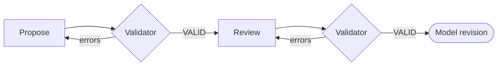

# Latent Structure Proposal

| Modality | Interactive | Produces |
|---|---|---|
| Semantic | Yes | [`ModelSpec`](#modelspec) |

Builds a causal DAG[^pearl2009] ([`ModelSpec`](#modelspec)) from the natural language research question.

## Inputs

| Input | Source | Description |
|---|---|---|
| `question` | User's research question in natural language |

Notably, there is no observed data input at this transition.

## Process

`latent_structure` transition runs a single LLM conversation in which the LLM reasons purely from domain knowledge and the research question to specify a theoretical causal DAG.

The conversation has two phases: an initial proposal checked by a structural validation tool, followed by a self-review pass using the same validator.

**Propose:** The LLM works backward from the outcome implied by the question: what directly causes it, what causes those causes, and so on. The goal is completeness over parsimony: downstream pipeline transitions will prune based on identifiability; this transition must not omit anything causally important.

Each proposed construct is classified by [role and temporal status](../reference/latent-structure/constructs-and-edges.md#construct-dimensions), and each directed edge carries a [lag designation](../reference/latent-structure/constructs-and-edges.md#edge-lag-rules)—lagged (cause at *t−1* → effect at *t*) or contemporaneous (within the same time index).

**Validator:** The LLM submits its proposal via a `validate_latent_structure` tool call. The tool accepts a whole candidate `ModelSpec` as `model_json` and enforces its contract:

- *Construct-role invariants and temporal rules* from [constructs-and-edges.md](../reference/latent-structure/constructs-and-edges.md)
- *Assumption-derived restrictions* from [A4](../reference/latent-structure/assumptions.md#a4-acyclicity-within-time-slice), [A4b](../reference/latent-structure/assumptions.md#a4b-endogenous-time-varying-directed-effects-are-drift-mediated), and [A5](../reference/latent-structure/assumptions.md#a5-time-invariant-latents-as-subject-level-static-states)
- *Identity integrity:* every reference resolves inside the model; indicators and mechanisms have exactly one owner

On failure the tool returns the specific errors; the LLM revises and resubmits within the same conversation until the tool returns VALID.

**Review:** A follow-up prompt then asks the LLM to review its validated model for theoretical coherence—outcome clarity, causal completeness, edge justification, temporal consistency, and whether exogenous designations are appropriate. If the review surfaces issues, the LLM revises and re-validates before the conversation ends.

### Example

For a question about whether tutoring intensity improves exam performance through study confidence, `latent_structure` transition may posit constructs such as `Tutoring Intensity`, `Study Confidence`, `Prior Mastery`, and `Exam Performance`. Causal edges would connect `Tutoring Intensity` → `Study Confidence` → `Exam Performance`, with a lagged edge from `Prior Mastery` → `Exam Performance`.

## Outputs

| Output | Type | Description |
|---|---|---|
| `model` | Canonical scientific definition, initially declaring one connected graph and an optional default outcome |

### ModelSpec

| Field | Description |
|---|---|
| `default_outcome` | Optional endogenous target for the workflow’s default question; individual [scenario queries](analysis.md#scenariorequest) own their outcome selection |
| `edges` | Nonempty directed relationships forming one connected graph when arrow direction is ignored; `cause` and `effect` resolve to shared construct endpoints, and each edge owns additive mechanisms |
| `parameters` | Shared [scientific quantities and distributions](statistical-model-spec.md#parameterspec), referenced by persistent ID |
| `measurement_clock` | [Shared measurement clock](measurement-structure.md#observation_window-and-measurement_clock), absent before measurement choices |
| `distributions` | Shared native NumPyro laws, referenced by the parameters and constructs that participate in each joint distribution |
| `time_points` | Time grid for construct trajectory distributions, filled when conditioning on observations |

`model.constructs` is a derived enumeration of unique endpoints, absent from the
serialized ModelSpec. JSON defines each construct once at an edge endpoint and
uses a `ConstructRef` for its other occurrences. Endpoint references may precede
definitions; undefined references and conflicting definitions are rejected.

### `Construct`

| Field | Description |
|---|---|
| `id` | Persistent `construct:` identity, preserved when revising or renaming the same entity |
| `name` | Current construct name |
| `description` | Meaning of the construct |
| `role` | Endogenous or exogenous |
| `temporal_status` | Time-varying or time-invariant |
| `indicators` | Owned [measurement definitions](measurement-structure.md#indicator) |
| `dynamics` | Owned additive [intrinsic dynamics](statistical-model-spec.md#dynamicsmechanism) |
| `innovation`, `initial_state` | Owned [state distributions](statistical-model-spec.md#state-distributions), added during statistical authoring |
| `distribution` | Current trajectory uncertainty on the ModelSpec time grid |
| `usage` | An explicit [execution choice](measurement-structure.md#model-measurement-choices), when needed |

### `CausalEdge`

| Field | Description |
|---|---|
| `id` | Persistent `edge:` identity, preserved when revising the same edge |
| `cause`, `effect` | The actual endpoint constructs in Python; repeated JSON endpoints reference the same definition |
| `description` | Theoretical justification for the causal relationship |
| `lagged` | Whether the cause precedes the effect by one model-clock tick |
| `sources` | Supporting literature with title, optional URL, and excerpt |
| `mechanisms` | Additive [effect functions](statistical-model-spec.md#dynamicsmechanism), each retaining its own identity |

[^pearl2009]: Pearl, J. (2009). *Causality: Models, Reasoning, and Inference* (2nd ed.). Cambridge University Press. [Bibliography entry](../reference/bibliography.md)
