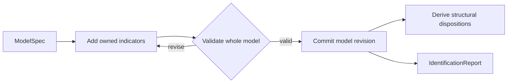

# Measurement Structure and Identifiability

| Modality | Interactive | Produces |
|---|---|---|
| Semantic | Yes | A revised [`ModelSpec`](latent-structure.md#modelspec), plus an [`IdentificationReport`](#identificationreport) |

Operationalizes the [`ModelSpec`](latent-structure.md#modelspec) against observed data by specifying indicators for each construct, then checks whether each treatment-to-outcome effect is causally identifiable[^pearl2009].

## Inputs

| Input | Source | Description |
|---|---|---|
| `model` | [`latent_structure` transition](latent-structure.md) | `ModelSpec` with its research question, constructs, and edges |
| `raw_data` | [`raw_data` transition](ingestion.md#outputs) | Raw Arrow table with column descriptions |

`latent_structure` transition provided theoretical structure without seeing any data. `measurement_structure` transition is the first point where the model meets the dataset.

## Process

`measurement_structure` transition runs one LLM conversation that bridges theory and data. The LLM sees the latent structure, the research question, and a schema summary of the ingested dataset. The conversation has two phases: an initial measurement-structure proposal checked by a validation tool, followed by a self-review pass using the same validator.

**Propose:** For each construct in the latent structure, the LLM proposes one or more indicators: observed variables that operationalize the construct in this dataset. Each indicator names the source columns it uses, how extraction will work, what kind of value it produces, and over what support window that value is defined. Exact observations use the indicator’s [Delta likelihood](statistical-model-spec.md#likelihoodspec). Source recording semantics determine which gaps can be resolved before inference.

**Validator:** The LLM submits the whole candidate as `model_json` to `validate_measurement_structure`. The tool checks scientific schema and measurement constraints:

- *Outcome coverage:* every outcome construct has at least one indicator
- *No duplicate indicator definitions* across indicators
- *Valid construct references:* indicator references point to constructs in the latent structure
- *Dtype–aggregation compatibility:* `measurement_dtype` and `aggregation` are compatible
- *Computed-rule validity:* computed indicators have valid rule expressions
- *Source recording:* complete event/change records require computed extraction and compatible aggregation

Partial measurement proposals remain valid scientific models. The reader shows structural dispositions; numerical operations validate execution requirements and reject unsupported structure.

After the candidate model validates, the machine checks [causal identifiability](../reference/causal-design/identifiability.md) for each treatment-to-outcome pair. Production identification uses nonparametric do-calculus. A linear instrumental-variable argument cannot authorize a causal claim for the nonlinear `ModelSpec`; the public identification contract accepts only `method="do_calculus"`.

**Review:** A follow-up prompt asks the LLM to review its validated measurement structure for coverage, operationalization clarity in `how_to_measure`, observation-window semantics, the [reflective measurement assumption](../reference/measurement-structure/assumptions.md#a1-reflective-measurement-structure), absence of cumulative or running metrics, and whether complete event/change records are justified by the source evidence. If the review surfaces issues, the LLM revises and re-validates before the conversation ends.

### Example

For a study of developer workload and code quality, `measurement_structure` transition might map `Developer Workload` to indicators like "number of open PRs assigned" (computed, count) and "sprint velocity" (computed, mean), and map `Review Thoroughness` to "average review comment count per PR" (computed, mean). An assigned on-call shift can have an exact schedule indicator. A complete change record establishes persistence; sparse readings alone leave intervening values unknown.

## Outputs

| Field | Description |
|---|---|
| `model` | The same [`ModelSpec`](latent-structure.md#modelspec) enriched with owned indicators, a measurement clock, and source recording semantics |
| `identification_report` | [`IdentificationReport`](#identificationreport) with positive and negative findings for the model's default causal query |

### Model Measurement Choices

| Field | Description |
|---|---|
| `ModelSpec.measurement_clock` | Shared window and default lag unit |
| `ConstructSpec.indicators` | Reflective measurement definitions owned by that scientific entity |

Indicators are reflective[^bollen1989]: the construct causes the indicator value. The [measurement assumptions](../reference/measurement-structure/assumptions.md) define that commitment.

### `IndicatorSpec`

| Field | Description |
|---|---|
| `id` | Persistent `IndicatorId` (`indicator:` identity), preserved when revising or renaming the same indicator |
| `name` | Current indicator name used downstream |
| `how_to_measure` | Human-readable measurement instructions grounded in the dataset |
| `measurement_dtype` | Semantic value type: `continuous`, `binary`, `count`, `ordinal`, or `categorical` |
| `aggregation` | Summary operator applied within each realized support window |
| `recording` | `samples` (default), `events`, or `changes`: missing readings, complete event records, or complete change records |
| `observation_window` | Optional window width such as `"1d"` or `"1w"`; defaults to the model clock |
| `ordinal_levels` | Ordered label list when `measurement_dtype="ordinal"`; otherwise absent |
| `categorical_levels` | Exhaustive label list when `measurement_dtype="categorical"`; otherwise absent |
| `source_columns` | Raw columns needed to compute or interpret the indicator |
| `computed_rule` | Optional validated `WindowExpression` string producing one scalar per window from declared source columns; requires computed extraction |
| `extraction_mode` | Whether extraction is deterministic (`computed`) or LLM-mediated (`semantic`) |
| `construct_polarity` | Whether increasing indicator values represent more or less of its construct |
| `likelihood` | Owned [measurement likelihood](statistical-model-spec.md#likelihoodspec), absent before statistical specification |

### Source recording and exactness

`recording="samples"` preserves missing readings. For computed extraction,
`recording="events"` declares a complete event record over the raw dataset’s
covered span: empty sum/count windows produce zero. An explicitly missing value
in an observed sum window remains unknown. `recording="changes"` requires `last`
aggregation and carries the most recent value forward across windows. Leading
gaps remain unknown. Neither rule fills times outside the covered raw-data span.

`first` and `last` alone select a point; they do not imply persistence. Unit
conversion belongs in `computed_rule`, for example `last(dose_mg) / 10`.

A [Delta law](../reference/statistical-model-spec/likelihoods.md) fixes observed
coordinates. It does not remove a construct’s initial density or transition
density, nor does it determine a continuous trajectory between sparse points.
The current particle engine supports direct point constraints; exact interval
summaries still require a sampler that preserves those constraints.

### `observation_window` and `measurement_clock`

Examples of indicator-level observation windows:

- "Average heart rate over the previous day"
- "Number of production incidents during the previous week"
- "Teacher feedback sentiment in the current grading period"

Different indicators may use different `observation_window` values as long as they are aligned back onto the shared `measurement_clock`.

### Indicator Level `aggregation`

| Operator | Support meaning | Typical anchor |
|---|---|---|
| `mean` | Average level over the window matters | `support_end` |
| `sum` | Cumulative amount over the window matters | `support_end` |
| `count` | Event frequency over the window matters | `support_end` |
| `last` | The most recent observed state in the window matters | `support_end` |
| `first` | The earliest observed state in the window matters | `support_start` |
| `std` | Within-window instability matters | `support_end` |

These are substantive commitments, not mere implementation details. A daily mean mood score and an end-of-day mood score encode different theories of what matters.

### Derived Observation Semantics

The `ModelSpec` does not store row timestamps itself, but it fully determines the row-level support semantics that [`measurements` transition](extraction.md) materializes into [`ObservationRecord`](extraction.md#observationrecord) fields. The derivation is deterministic: the indicator's `aggregation` operator selects the `support_kind` (point vs. interval) and the `anchor_policy` per the "Typical anchor" column above.

### Execution Structure

[ModelSpec structural accessors](../reference/compilation.md#structural-derivation) derive retained state and observation order, reference indicators and dependencies induced by marginalized latent roots. Compilation validates these selections. The model snapshot exposes the resulting dispositions as findings sourced to its model revision. Admission checks select their coordinates in an operation-local view. Required unmeasured constructs must have supported marginalization semantics; incomplete dynamics and unsupported static-target edges fail explicitly. No construct owns an execution-selection flag.

### `IdentificationReport`

| Field | Description |
|---|---|
| `treatments` | One finding per treatment ID (`ConstructId`), discriminated by `status`: `identified` carries the do-calculus method, estimand, marginalized confounder IDs, and instrument IDs; `not_identified` carries blocking confounder IDs and optional notes |

The identifiability assumptions, including temporal unrolling and the internal DAG-to-ADMG projection, live in [causal-design/identifiability.md](../reference/causal-design/identifiability.md).

[^pearl2009]: Pearl, J. (2009). *Causality: Models, Reasoning, and Inference* (2nd ed.). Cambridge University Press. [Bibliography entry](../reference/bibliography.md)
[^bollen1989]: Bollen, K. A. (1989). *Structural Equations with Latent Variables*. Wiley. [Bibliography entry](../reference/bibliography.md)
