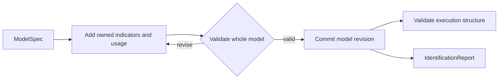

# Measurement Structure and Identifiability

| Modality | Interactive | Produces |
|---|---|---|
| Semantic | Yes | A revised [`ModelSpec`](latent-structure.md#modelspec), plus an [`IdentificationReport`](#identificationreport) |

Operationalizes the [`ModelSpec`](latent-structure.md#modelspec) against observed data by specifying indicators for each construct, then checks whether each treatment-to-outcome effect is causally identifiable[^pearl2009].

## Inputs

| Input | Source | Description |
|---|---|---|
| `question` | User | Original research question, used to justify measurement choices |
| `model` | [`latent_structure` transition](latent-structure.md) | `ModelSpec` with constructs and edges |
| `raw_data` | [`raw_data` transition](ingestion.md#outputs) | Raw Arrow table with column descriptions |

`latent_structure` transition provided theoretical structure without seeing any data. `measurement_structure` transition is the first point where the model meets the dataset.

## Process

`measurement_structure` transition runs one LLM conversation that bridges theory and data. The LLM sees the latent structure, the research question, and a schema summary of the ingested dataset. The conversation has two phases: an initial measurement-structure and known-input proposal checked by a validation tool, followed by a self-review pass using the same validator.

**Propose:** For each construct in the latent structure, the LLM proposes one or more indicators: observed variables that operationalize the construct in this dataset. Each indicator names the source columns it uses, how extraction will work, what kind of value it produces, and over what support window that value is defined. When a directly observed construct trajectory should condition the dynamics rather than remain a latent state, the proposal also identifies its source indicator as a known input.

**Validator:** The LLM submits the whole candidate as `model_json` to `validate_measurement_structure`. The tool checks schema and compiler constraints:

- *Outcome coverage:* every outcome construct has at least one indicator
- *No duplicate indicator definitions* across indicators
- *Valid construct references:* indicator references point to constructs in the latent structure
- *Dtype–aggregation compatibility:* `measurement_dtype` and `aggregation` are compatible
- *Computed-rule validity:* computed indicators have valid rule expressions
- *Known-input integrity:* declarations reference an existing construct and an indicator that measures that same construct
- *Structural compilation:* every construct, edge, and indicator receives an explicit disposition; retained states satisfy coverage and loading-rank constraints; unsupported static-target edges are rejected

After the candidate model validates, the machine derives its execution plan and checks [causal identifiability](../reference/causal-design/identifiability.md) for each treatment-to-outcome pair. Production identification uses nonparametric do-calculus. A linear instrumental-variable argument cannot authorize a causal claim for the nonlinear `ModelSpec`; the public identification contract accepts only `method="do_calculus"`.

**Review:** A follow-up prompt asks the LLM to review its validated measurement structure for coverage, operationalization clarity in `how_to_measure`, observation-window semantics, the [reflective measurement assumption](../reference/measurement-structure/assumptions.md#a1-reflective-measurement-structure), absence of cumulative or running metrics, and whether every known-input declaration is justified by direct observation and explicit missing-value semantics. If the review surfaces issues, the LLM revises and re-validates before the conversation ends.

### Example

For a study of developer workload and code quality, `measurement_structure` transition might map `Developer Workload` to indicators like "number of open PRs assigned" (computed, count) and "sprint velocity" (computed, mean), and map `Review Thoroughness` to "average review comment count per PR" (computed, mean). If an assigned on-call shift is represented as a construct with a directly recorded schedule indicator, it can be declared as a known input so its realized trajectory drives the retained latent states without becoming one itself.

## Outputs

| Output | Type | Description |
|---|---|---|
| `model` | [`ModelSpec`](latent-structure.md#modelspec) | The same scientific entities enriched with owned indicators, a measurement clock, and usage choices |
| `identification_report` | [`IdentificationReport`](#identificationreport) | Positive and negative findings for the model's default causal query |

### Model Measurement Choices

| Field | Owner | Description |
|---|---|---|
| `measurement_clock` | `ModelSpec` | Shared window and default lag unit |
| `indicators` | `Construct` | Reflective measurement definitions owned by that scientific entity |
| `usage` | `Construct` | Optional known-input or scientific-only declaration |

Indicators are reflective[^bollen1989]: the construct causes the indicator value. The [measurement assumptions](../reference/measurement-structure/assumptions.md) define that commitment.

### `Indicator`

| Field | Type | Description |
|---|---|---|
| `id` | `IndicatorId` | Persistent `indicator:` identity, preserved when revising or renaming the same indicator |
| `name` | `str` | Current indicator name used downstream |
| `how_to_measure` | `str` | Human-readable measurement instructions grounded in the dataset |
| `measurement_dtype` | `str` | Semantic value type: `continuous`, `binary`, `count`, `ordinal`, or `categorical` |
| `aggregation` | `str` | Summary operator applied within each realized support window |
| `observation_window` | `str` | Window width such as `"1d"` or `"1w"` over which one indicator value is defined |
| `ordinal_levels` | `list[str]` \| `null` | Ordered labels when `measurement_dtype="ordinal"` |
| `categorical_levels` | `list[str]` \| `null` | Exhaustive labels when `measurement_dtype="categorical"` |
| `source_columns` | `list[str]` | Raw columns needed to compute or interpret the indicator |
| `computed_rule` | `WindowExpression` \| `null` | Validated expression string producing one scalar per window from declared source columns; requires computed extraction |
| `extraction_mode` | `str` | Whether extraction is deterministic (`computed`) or LLM-mediated (`semantic`) |
| `construct_polarity` | `str` | Whether increasing indicator values represent more or less of its construct |
| `likelihood` | `LikelihoodSpec` ∣ `null` | Owned [measurement likelihood](statistical-model-spec.md#likelihoodspec), absent before statistical specification |

### `KnownInput`

| Field | Type | Description |
|---|---|---|
| `kind` | `"known_input"` | The containing construct is an observed transition driver |
| `source_indicator_id` | `IndicatorId` | Indicator for the same construct that supplies the input trajectory |
| `scale` | `float` | Positive divisor applied to the source values before inference |
| `missing_policy` | `str` | Whether missing grid values become zero or carry the last observed value forward |

### `ScientificOnlyConstruct`

| Field | Type | Description |
|---|---|---|
| `kind` | `"scientific_only"` | The containing construct remains in the scientific DAG and is excluded from the executable state vector |
| `reason` | `str` | Explicit scientific or identification rationale for the exclusion |

### `observation_window` and `measurement_clock`

Examples of indicator-level observation windows:

- "Average heart rate over the previous day"
- "Number of production incidents during the previous week"
- "Teacher feedback sentiment in the current grading period"

Different indicators may use different `observation_window` values as long as they are aligned back onto the shared `measurement_clock`.

### Indicator Level `aggregation`

| Operator | Support meaning | Typical anchor |
|---|---|---|
| `mean` | Average level over the window matters | `support_end` |
| `sum` | Cumulative amount over the window matters | `support_end` |
| `count` | Event frequency over the window matters | `support_end` |
| `last` | The most recent observed state in the window matters | `support_end` |
| `first` | The earliest observed state in the window matters | `support_start` |
| `std` | Within-window instability matters | `support_end` |

These are substantive commitments, not mere implementation details. A daily mean mood score and an end-of-day mood score encode different theories of what matters.

### Derived Observation Semantics

The `ModelSpec` does not store row timestamps itself, but it fully determines the row-level support semantics that [`measurements` transition](extraction.md) materializes into [`ObservationRecord`](extraction.md#observationrecord) fields. The derivation is deterministic: the indicator's `aggregation` operator selects the `support_kind` (point vs. interval) and the `anchor_policy` per the "Typical anchor" column above.

### Execution Structure

[ModelSpec structural accessors](../reference/compilation.md#structural-derivation) derive retained state and observation order, reference indicators, known inputs, and dependencies induced by marginalized latent roots. Compilation validates these selections. The model snapshot exposes the resulting dispositions as findings sourced to its model revision. There is no separately persisted execution plan.

### `IdentifiabilityStatus`

| Field | Type | Description |
|---|---|---|
| `identifiable_treatments` | `dict[ConstructId, IdentifiedTreatmentStatus]` | Treatment IDs mapped to the identification method, estimand, marginalized confounder IDs, and instrument IDs |
| `non_identifiable_treatments` | `dict[ConstructId, NonIdentifiableTreatmentStatus]` | Treatment IDs mapped to blocking confounder IDs and optional notes |

### `IdentificationReport`

| Field | Type | Description |
|---|---|---|
| `outcome` | `ConstructId` ∣ `null` | Default outcome selected in the pinned model |
| `status` | [`IdentifiabilityStatus`](#identifiabilitystatus) | Positive and negative treatment findings, including blocking confounders |

The identifiability assumptions, including temporal unrolling and the internal DAG-to-ADMG projection, live in [causal-design/identifiability.md](../reference/causal-design/identifiability.md).

[^pearl2009]: Pearl, J. (2009). *Causality: Models, Reasoning, and Inference* (2nd ed.). Cambridge University Press. [Bibliography entry](../reference/bibliography.md)
[^bollen1989]: Bollen, K. A. (1989). *Structural Equations with Latent Variables*. Wiley. [Bibliography entry](../reference/bibliography.md)
