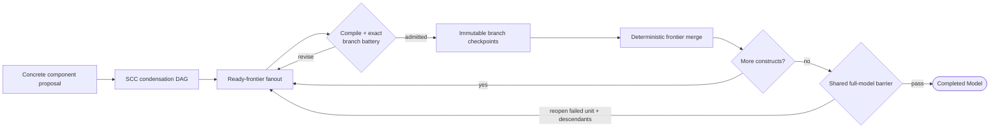

# Statistical Model Specification and Prior Elicitation

| Modality | Interactive | Produces |
|---|---|---|
| Semantic | Yes | `ModelSpec` with a native prior on each parameter |

This optional authoring recipe enriches the [measurement-stage ModelSpec](measurement-structure.md) into a fully specified statistical model by choosing observation-model distributions for ambiguous indicators and eliciting Bayesian priors for every parameter, validated against prior predictive checks. Direct [`edit_model` submissions](../reference/scientific-actions.md) can interleave these choices and do not require recipe admissions.

For the high-level reducer flow, see the [`statistical_model_spec` construct-admission state machine](../reference/statistical-model-spec/state-machine.md). For its exact prompts, validation, checkpoint, and recovery semantics, see the [LLM-driven specification](../reference/statistical-model-spec/llm-driven-specification.md).

## Inputs

| Input | Source | Description |
|---|---|---|
| `model` | [Measurement authoring](measurement-structure.md) | The research question and scientific entities to enrich with likelihoods, dynamics, parameters, and priors |
| `data_for_model` | [`measurements` transition](extraction.md) | Encoded long-format [`ObservationRecord`](extraction.md#observationrecord) table |
| `indicator_audits` | [`validation_report` derivation](extraction-validation.md) | Per-indicator [`EmpiricalProfile`](extraction-validation.md#empiricalprofile)s and validation summaries |
| `enable_literature` | Pipeline config | Whether the `search_literature` tool is offered to the LLM |

Within this recipe, `statistical_model_spec` follows measurement authoring and reasons about statistical model form. Direct actions have no such authoring order.

## Process

`statistical_model_spec` transition admits constructs incrementally along the causal topology. Independent ready constructs use concurrent LLM subroutines, while members of a feedback component remain sequential. Deterministic code compiles each cumulative partial model and runs the exact prior-predictive reachability battery before accepting a branch.

**Component proposal:** Before LLM judgment, deterministic authoring proposes concrete mechanisms, [likelihoods](../reference/statistical-model-spec/likelihoods.md), innovation and initial-state components, and their coefficient references. Prompt rows describe the parameters used by that proposal. The LLM may revise supported components and declare the parameters they reference while preserving the causal structure and measurement definitions.

**Admission Topology:** Strongly connected components of the model’s retained execution edges form a deterministic condensation DAG. All ready singleton units may run concurrently. Members of a lagged feedback component remain adjacent and sequential, and the edge that closes a feedback loop is authored when its final endpoint is admitted.

**Construct Submission:** The active construct submission contains:

- conditional probability expressions for its indicators;
- innovation and initial-state coefficients, and priors for its referenced parameters;
- priors for incoming or cycle-closing causal effects; and
- optional written acceptance rationales for soft reachability findings.

Each submission includes the components and their parameter definitions together. Parameter coefficient slots reference stable IDs; fixed slots carry model-scale values. The complete candidate rejects dangling references and unused parameter definitions. A cycle-closing construct must author the closing edge in the same submission so the restricted cumulative model never contains an unbound edge site.

**Validation:** Each submission compiles its immutable causal-ancestor closure plus the proposed construct and simulates it through the exact nonlinear prior-predictive engine. Hard failures require revision. Soft failures require either revision or an explicit rationale accepting the consequence. Each successful branch merges as it completes, allowing newly ready descendants to start while unrelated work remains in flight.

**Full-Model Barrier:** Once every construct is accepted, deterministic code compiles the complete model once and draws one shared exact prior-predictive sample set. Every construct is rechecked against that same model. A failure reopens the failing feedback unit from that member onward and all descendant units while retaining independent admitted branches.

When enabled, the LLM can query [Exa](https://exa.ai/) for empirical studies to inform prior calibration, justifying narrower priors only when the estimand, population, and timescale align[^gelman2020] [^gelman2013].

The reachability battery includes:

- *Numerical health and confinement*: exact nonlinear SDE trajectories must remain finite; sustained growth is surfaced separately.
- *Marginal latent scale*: across-draw late-time scale must remain compatible with the standardized-latent convention.
- *Design resolvability*: sufficient prior timescale mass must be visible through the active construct's actual irregular observation gaps and span.
- *Edge influence and Hill activation*: same-noise per-edge contrasts detect parent-dominated dynamics, while draw-paired Hill occupancy checks the actual nonnegative response region.
- *Replicated-data checks*: family-specific location and dispersion statistics compare the observed panel with complete prior-replicate datasets rather than flattened samples.
- *Transmission*: the support-aware expected response must move meaningfully relative to the sampled predictive response.

Only deterministic numerical failures are hard gates. Monte Carlo discrepancies require revision or an exact target-scoped acceptance rationale. When a submission closes a feedback component, every affected member is rechecked before the tentative state is committed.

### Checkpointing and Recovery

Checkpoints are immutable execution sidecars. Original LLM submissions and their revision history live in the state-machine records; each model parameter references its current model-owned distribution. They store the accepted dependency-closed set, exact input-version pins, validation outcomes, search state, repair feedback, and full-model barrier status. Concurrent submissions write immutable child checkpoints from their launch snapshots; one merge activity serializes each completion batch into the next master checkpoint. The completed `model` and its [prior-predictive result](#priorpredictiveresult) are committed only after every construct is admitted and the barrier passes. Run completion and input freshness determine whether authoring needs to run again.

Temporal resumes an interrupted in-flight workflow from its recorded activity and child-workflow history. When a model-spec run terminates, its episode-journal record carries a typed run/checkpoint selection. The checkpoint layer resolves that selection when the outer orchestrator modifies an upstream artifact through normal machine moves and runs `statistical_model_spec` again.

On the next run:

- unchanged input pins restore the accepted dependency-closed set without rerunning it;
- changed input pins rebuild the component proposal and replay saved contributions through the same exact admission checks; and
- each invalid unit and its descendants reopen while independent valid branches remain accepted.

Each accepted tool submission is keyed by its tool-request identifier. Retrying the activity returns the same immutable checkpoint rather than applying the submission twice.

### Example

For a study of classroom engagement and academic performance, the transition could admit independent `Teacher Feedback Frequency` and `Home Study Support` roots concurrently. Once their branch checkpoints merge, `Student Engagement` authors its dynamics and incoming effects. A feedback pair involving engagement stays sequential, and the complete model must pass the shared barrier before the transition writes its public artifact.

## Outputs

| Output | Type | Description |
|---|---|---|
| `model` | [`ModelSpec`](latent-structure.md#modelspec) | Completed scientific entities, owned components, parameter definitions, and priors |
| Journal `diagnostics.prior_predictive` | [`PriorPredictiveResult`](#priorpredictiveresult) | Simulated observations and construct-level checks, tied to the completed model and the run's input versions |

### LikelihoodSpec

| Field | Type | Description |
|---|---|---|
| `law` | `ObservationLawSpec` | Native distribution constructor whose arguments are expressions over scientific states and coefficients |
| `standardized` | `bool` | Declared standardization choice for eligible additive-location indicators |
| `reasoning` | `str` | Scientific justification |
| `sources` | `tuple[LiteratureSource, ...]` | Evidence for the choice |

The [conditional law grammar](../reference/statistical-model-spec/likelihoods.md#conditional-expressions) composes native constructor arguments from the same expressions used by dynamics. For example, `Normal(loc=a + b * state(x), scale=s)` and `Bernoulli(logits=a + b * state(x))` declare the complete observation formula. State and parameter references use persistent scientific identities. Coefficient operands carry their scientific roles and may remain explicitly unassigned in a partial model; authoring fills them before execution.

Parameter ownership, support checks, numerical lowering, and displayed observation equations derive from this declaration. The compiler recognizes the supported affine predictors and response functions, preserving the existing exact emission kernels and the indicator's interval and category semantics. Unsupported formulas fail validation.

### ParameterSpec

| Field | Description |
|---|---|
| `id` | Stable identity referenced by component coefficients; preserved through model revisions |
| `name` | Display label; references use the identity |
| `description` | Scientific interpretation |
| `distribution` | ID of a law in `ModelSpec.distributions`; required for a free parameter in a complete model |
| `value` | Fixed model-scale value, mutually exclusive with a distribution |
| `distribution_transform` | Identity, interval persistence to decay, interval effect to rate, or initial correlation |
| `reference_interval_days` | Positive interval defining an authored interval-scale distribution |

Authoring rationales and supporting sources belong in the state-machine log. Fitting updates the same parameter's law membership in a new ModelSpec revision; the original law remains available in the input revision.

Prior density curves are computed on backend reads from the native NumPyro law, on the declared authoring scale. A small deterministic prior draw sets the plotting range; curve heights use the native `log_prob`. Curves are cached for display and never stored in `ParameterSpec` or used by inference. Joint, batched, discrete, and point-mass laws do not have a scalar density plot.

### Model Statistical Choices

| Field | Owner | Description |
|---|---|---|
| `dynamics` | `ConstructSpec` | Intrinsic drift contributions and node potentials |
| `likelihood` | `IndicatorSpec` | Conditional probability law, standardization, and evidence |
| `mechanisms` | `CausalEdgeSpec` | Additive causal effect functions |
| `coefficients` | `ConstructSpec` | Shared coefficient expressions for diffusion scale and loadings, initial mean and scale, correlations, and the optional process tail parameter |
| `innovation_family` | `ConstructSpec` | Gaussian or Student-t driving noise |
| `parameters` | `ModelSpec` | Referenced definitions with law memberships or fixed values |
| `distributions` | `ModelSpec` | Native NumPyro laws keyed by the IDs referenced by parameters and constructs |

### Construct Coefficients

The same [coefficient expressions](../../apps/data-pipeline/src/nof1_causal_lab/artifacts/expressions.py) used in dynamics and likelihoods declare construct-level scalar uses. Existing numerical assembly maps these uses to diffusion and initial-distribution coordinates.

| Field | Description |
|---|---|
| `role` | `diffusion_scale`, `diffusion_loading`, `process_degrees_of_freedom`, `initial_mean`, `initial_scale`, or `initial_correlation` |
| `value` | Finite number or persistent parameter ID; `null` marks an incomplete declaration |
| `construct_ids` | One additional construct for a joint loading or correlation; empty for a scalar use |

| Role | Numerical use | Description |
|---|---|---|
| `diffusion_scale`, `diffusion_loading` | Diffusion factor | Marginal driving scale and conditional noise coordinates |
| `initial_mean`, `initial_scale`, `initial_correlation` | Initial distribution | Initial location, marginal scale, and joint correlations; unmeasured static roots share their baseline scale |
| `process_degrees_of_freedom` | Process tail parameter | Shared parameter for Student-t innovations |

### DynamicsMechanismSpec

| Field | Description |
|---|---|
| `id` | Persistent identity of one dynamics contribution, preserved through revisions and reordering |
| `kind` | `"drift"` adds the expression to the owning state's derivative; `"potential"` declares a node energy whose negative gradient contributes to the drift |
| `expression` | A scalar [expression](../../apps/data-pipeline/src/nof1_causal_lab/artifacts/expressions.py) with explicit construct and coefficient references |

| Expression form | Meaning |
|---|---|
| `literal` | A finite numerical constant |
| `state` | A construct's state or declared known input, referenced by its ID |
| `coefficient` | A fixed value or parameter reference, with its scientific role and support |
| `binary` | Addition, subtraction, multiplication, division, power, or maximum of two expressions |

Scientific constructors such as `restoring_potential`, `linear_effect`, and `hill` expand into this language. Multiplying a Hill expression by another state expresses moderation without a separate edge-specification class. The [numerical compiler](../../apps/data-pipeline/src/nof1_causal_lab/models/ssm/dynamics/expression.py) binds parameter references directly. [Dynestyx state evolution](../../apps/data-pipeline/src/nof1_causal_lab/models/ssm/dynamics/vector_field.py) differentiates declared node potentials and adds the remaining drift expressions; [displayed equations](../../apps/data-pipeline/src/nof1_causal_lab/machine/equations.py) interpret the same tree.

Intrinsic dynamics reference only their owning construct. Potentials belong to nodes; directed edges require drift terms. An edge expression references its primary cause, and any additional state dependencies require explicit causal edges into its effect. Fixed coefficient values must satisfy their declared support. Location anchoring requires a complete restoring expression of the declared kind; a coefficient's role alone does not certify an anchor. Known-input and marginalized-confounder matrix boundaries continue to require a scalar linear expression.

### CoefficientExpression

| Field | Description |
|---|---|
| `kind` | `"coefficient"`, identifying an operand in the expression grammar |
| `role` | Scientific meaning and required support of this use |
| `value` | Finite model-scale number, persistent [parameter ID](#parameterspec), or `null` while unassigned |
| `construct_ids` | Additional constructs participating in a joint coefficient use |

For example, `{"kind": "coefficient", "role": "loading", "value": 1}` declares a fixed unit loading. A parameter ID in `value` references the same scientific quantity wherever it appears; its role describes the local use. Zero is an assigned value. No nested fixed-value or parameter-reference record is stored.

### PriorPredictiveResult

| Field | Type | Description |
|---|---|---|
| `samples` | `dict[IndicatorId, list[float]]` | Exact prior-predictive observations for Data-vs-Prior inspection |
| `diagnostics` | `list[PriorPredictiveDiagnostic]` | Construct-level checks, including feedback-component rechecks |

The [model snapshot](../design/model-snapshot.md) exposes the result as `findings.prior_predictive`, sourced to its journal record. Research queries remain in authoring traces and `diagnostics.search_queries`; compiler findings retain their [`PriorValidationResult`](../../apps/data-pipeline/src/nof1_causal_lab/artifacts/prior.py) structure in `diagnostics.validation_diagnostics`. Admission progress and acceptance decisions remain in execution checkpoints. A completed operation can be recognized independently of whether predictive results were retained.

[^gelman2020]: Gelman, A., Vehtari, A., Simpson, D., et al. (2020). Bayesian Workflow. arXiv:2011.01808. [Bibliography entry](../reference/bibliography.md)
[^gelman2013]: Gelman, A., Carlin, J. B., Stern, H. S., Dunson, D. B., Vehtari, A., & Rubin, D. B. (2013). *Bayesian Data Analysis* (3rd ed.). CRC Press. [Bibliography entry](../reference/bibliography.md)
