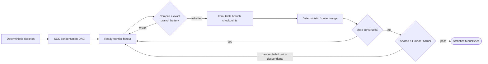

# Statistical Model Specification and Prior Elicitation

| Modality | Interactive | Produces |
|---|---|---|
| Semantic | Yes | `StatisticalModelSpec` with a native prior on each parameter |

Translates the [`measurement_structure` transition `StructuralPlan`](measurement-structure.md#structuralplan) into a fully specified statistical model by choosing observation-model distributions for ambiguous indicators and eliciting Bayesian priors for every parameter, validated against prior predictive checks.

For the high-level reducer flow, see the [`statistical_model_spec` construct-admission state machine](../reference/statistical-model-spec/state-machine.md). For its exact prompts, validation, checkpoint, and recovery semantics, see the [LLM-driven specification](../reference/statistical-model-spec/llm-driven-specification.md).

## Inputs

| Input | Source | Description |
|---|---|---|
| `question` | User | Original research question, used to justify prior reasoning |
| `structural_plan` | [`measurement_structure` transition](measurement-structure.md) | [`StructuralPlan`](measurement-structure.md#structuralplan) with executable structure and compiler-aligned semantic metadata |
| `data_for_model` | [`measurements` transition](extraction.md) | Encoded long-format [`ObservationRecord`](extraction.md#observationrecord) table |
| `indicator_audits` | [`validation_report` derivation](extraction-validation.md) | Per-indicator [`EmpiricalProfile`](extraction-validation.md#empiricalprofile)s and validation summaries |
| `enable_literature` | Pipeline config | Whether the `search_literature` tool is offered to the LLM |

`statistical_model_spec` transition is the first point where the pipeline reasons about statistical model form. Earlier transitions defined what to measure and how.

## Process

`statistical_model_spec` transition admits constructs incrementally along the causal topology. Independent ready constructs use concurrent LLM subroutines, while members of a feedback component remain sequential. Deterministic code compiles each cumulative partial model and runs the exact prior-predictive reachability battery before accepting a branch.

**Skeleton:** Before any LLM judgment, deterministic code derives the compiler-authoritative parameter catalog, admissible [likelihoods](../reference/statistical-model-spec/likelihoods.md), loading orientations, and fixed structural policy. The LLM cannot invent parameters or causal edges.

**Admission Topology:** Strongly connected components of the structural plan form a deterministic condensation DAG. All ready singleton units may run concurrently. Members of a lagged feedback component remain adjacent and sequential, and the edge that closes a feedback loop is authored when its final endpoint is admitted.

**Construct Submission:** The active construct submission contains:

- distribution and link choices for its indicators;
- priors for its compiler-authoritative parameter surface;
- priors for incoming or cycle-closing causal effects; and
- optional written acceptance rationales for soft reachability findings.

Each submission declares its mechanisms separately from its priors. Estimated coefficient slots reference parameter IDs; fixed slots carry continuous-time values. Unknown or non-free authoring aliases are rejected. A cycle-closing construct must author the closing edge in the same submission so the restricted cumulative model never contains an unbound edge site.

**Validation:** Each submission compiles its immutable causal-ancestor closure plus the proposed construct and simulates it through the exact nonlinear prior-predictive engine. Hard failures require revision. Soft failures require either revision or an explicit rationale accepting the consequence. Each successful branch merges as it completes, allowing newly ready descendants to start while unrelated work remains in flight.

**Full-Model Barrier:** Once every construct is accepted, deterministic code compiles the complete model once and draws one shared exact prior-predictive sample set. Every construct is rechecked against that same model. A failure reopens the failing feedback unit from that member onward and all descendant units while retaining independent admitted branches.

When enabled, the LLM can query [Exa](https://exa.ai/) for empirical studies to inform prior calibration, justifying narrower priors only when the estimand, population, and timescale align[^gelman2020] [^gelman2013].

The reachability battery includes:

- *Numerical health and confinement*: exact nonlinear SDE trajectories must remain finite; sustained growth is surfaced separately.
- *Marginal latent scale*: across-draw late-time scale must remain compatible with the standardized-latent convention.
- *Design resolvability*: sufficient prior timescale mass must be visible through the active construct's actual irregular observation gaps and span.
- *Edge influence and Hill activation*: same-noise per-edge contrasts detect parent-dominated dynamics, while draw-paired Hill occupancy checks the actual nonnegative response region.
- *Replicated-data checks*: family-specific location and dispersion statistics compare the observed panel with complete prior-replicate datasets rather than flattened samples.
- *Transmission*: the support-aware expected response must move meaningfully relative to the sampled predictive response.

Only deterministic numerical failures are hard gates. Monte Carlo discrepancies require revision or an exact target-scoped acceptance rationale. When a submission closes a feedback component, every affected member is rechecked before the tentative state is committed.

### Checkpointing and Recovery

Checkpoints are immutable execution sidecars. Original LLM submissions and their revision history live in the state-machine records; each model parameter carries only its current prior and scientific evidence. They store the accepted dependency-closed set, exact input-version pins, validation outcomes, search state, repair feedback, and full-model barrier status. Concurrent submissions write immutable child checkpoints from their launch snapshots; one merge activity serializes each completion batch into the next master checkpoint. The public `statistical_model_spec` artifact is written only after every construct is admitted and the barrier passes.

Temporal resumes an interrupted in-flight workflow from its recorded activity and child-workflow history. When a model-spec run terminates, its episode-journal record carries a typed run/checkpoint selection. The checkpoint layer resolves that selection when the outer orchestrator modifies an upstream artifact through normal machine moves and runs `statistical_model_spec` again.

On the next run:

- unchanged input pins restore the accepted dependency-closed set without rerunning it;
- changed input pins rebuild the deterministic skeleton and replay saved contributions through the same exact admission checks; and
- each invalid unit and its descendants reopen while independent valid branches remain accepted.

Each accepted tool submission is keyed by its tool-request identifier. Retrying the activity returns the same immutable checkpoint rather than applying the submission twice.

### Example

For a study of classroom engagement and academic performance, the transition could admit independent `Teacher Feedback Frequency` and `Home Study Support` roots concurrently. Once their branch checkpoints merge, `Student Engagement` authors its dynamics and incoming effects. A feedback pair involving engagement stays sequential, and the complete model must pass the shared barrier before the transition writes its public artifact.

## Outputs

| Output | Type | Description |
|---|---|---|
| `statistical_model_spec` | `StatisticalModelSpec` | Complete statistical model specification |
| `prior_predictive_diagnostics` | `list[PriorPredictiveDiagnostic]` | Compact accepted C1–C5 results, including feedback-component rechecks |
| `prior_predictive_samples` | `dict[IndicatorId, list[float]]` | Exact prior-predictive observation samples keyed by indicator ID for Data-vs-Prior inspection |
| `_compiled_ssm` | [`CompiledSSMArtifact`](../reference/compilation.md) | Serializable compiled model consumed by [`posterior` transition](inference.md); contains a nested compiled structure with total source bindings and anchor certificates, compiled prior semantics, parameter bindings, and compile diagnostics |

### StatisticalModelSpec.LikelihoodSpec

| Field | Type | Description |
|---|---|---|
| `indicator_id` | `IndicatorId` | Persistent identity of the observed [indicator](measurement-structure.md#indicator) |
| `distribution` | [`DistributionFamily`](../reference/statistical-model-spec/likelihoods.md#distribution-families) | Observation-model distribution family |
| `link` | [`LinkFunction`](../reference/statistical-model-spec/likelihoods.md#link-functions) | Link function mapping latent state to distribution parameter |
| `standardized` | `bool` | Deterministic auto-standardization flag for additive-location indicators whose observed values are mean-centered and scaled to unit sd before fitting |

### StatisticalModelSpec.ParameterSpec

| Field | Type | Description |
|---|---|---|
| `id` | `ParameterId` | Scientific identity based on the quantity and its explicit owners |
| `owners` | `list[EntityRef]` | Construct, indicator, and edge IDs owning this quantity |
| `quantity` | `SiteKind` | Meaning of the model quantity, including distinctions such as decay, input effect, and well centre |
| `name` | `str` | Display and authoring alias; references use `id` |
| `prior_transform` | `PriorAuthoringTransform` | Declared relationship between the authored prior scale and runtime quantity |
| `elements` | `dict[ParameterElementId, str]` | Logical scalar element IDs and display labels, filled by the compiler |
| `role` | [`ParameterRole`](../reference/statistical-model-spec/parameters.md#parameter-roles) | Role in the model |
| `constraint` | [`ParameterConstraint`](../reference/statistical-model-spec/parameters.md#parameter-roles) | Domain constraint |
| `description` | `str` | Human-readable description |
| `prior` | Native NumPyro `Distribution` ∣ `null` | Prior law on the declared authoring scale; unset during construction, required in the completed artifact |
| `reference_interval_days` | `float` ∣ `null` | Positive elicitation interval for interval-based priors |
| `prior_reasoning`, `prior_sources` | Evidence metadata | Current scientific rationale and supporting literature |
| `prior_density_points` | Density samples ∣ `null` | Backend-computed points for display |

### StatisticalModelSpec

| Field | Type | Description |
|---|---|---|
| `likelihoods` | `list[LikelihoodSpec]` | One likelihood row per retained manifest indicator |
| `mechanisms` | `list[DynamicsMechanism]` | Explicit drift components targeting construct or directed edge IDs, with fixed or estimated coefficient slots |
| `parameters` | `list[ParameterSpec]` | Compiler-authoritative semantic prior surfaces that remain active after model decisions are locked |
| `initialization_policy` | `\"stationary\" \| \"free\"` | Whether dynamic-state initial conditions are stationary-derived or exposed as free `t0_*` surfaces |
| `observation_intercept_policy` | `\"free\" \| \"fixed\"` | Whether eligible manifest intercepts `manifest_mean_*` remain free or are fixed |

### DynamicsMechanism

| Variant | Fields | Description |
|---|---|---|
| `NodePotentialMechanism` | `target_id`, `center`, `stiffness`, `quartic` | Restoring drift around a declared centre; a fixed zero quartic gives quadratic dynamics |
| `ConstantDriftMechanism` | `target_id`, `intercept` | Additive constant drift with an estimated coefficient |
| `LinearEdgeMechanism` | `edge_id`, `weight` | Linear effect of a state or known input, with an estimated coefficient |
| `HillEdgeMechanism` | `edge_id`, `emax`, `ec50`, `n` | Saturating effect with independently fixed or estimated coefficients |

### MechanismCoefficient

| Variant | Fields | Description |
|---|---|---|
| `FixedCoefficient` | `kind="fixed"`, `value` | Finite value on the continuous-time model scale |
| `EstimatedCoefficient` | `kind="estimated"`, `parameter_id` | Reference to the [parameter definition](#statisticalmodelspecparameterspec) whose prior and authoring transform define this coefficient |

[^gelman2020]: Gelman, A., Vehtari, A., Simpson, D., et al. (2020). Bayesian Workflow. arXiv:2011.01808. [Bibliography entry](../reference/bibliography.md)
[^gelman2013]: Gelman, A., Carlin, J. B., Stern, H. S., Dunson, D. B., Vehtari, A., & Rubin, D. B. (2013). *Bayesian Data Analysis* (3rd ed.). CRC Press. [Bibliography entry](../reference/bibliography.md)
