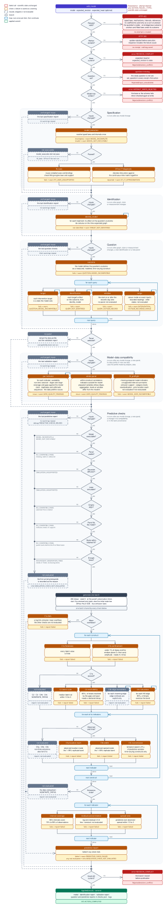
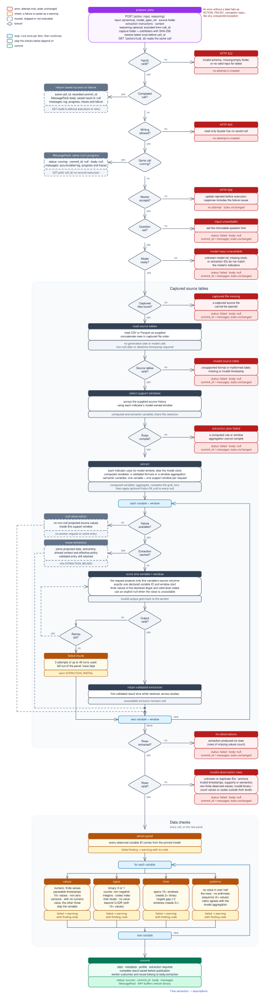
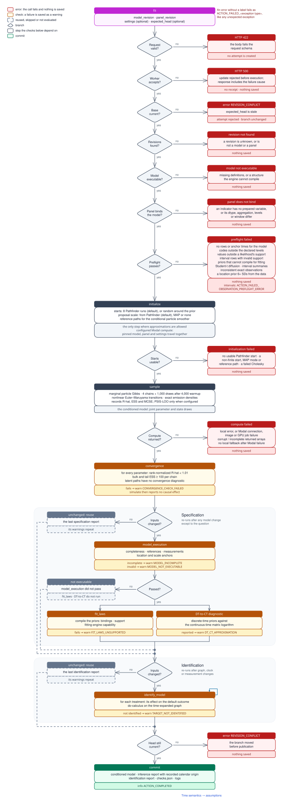
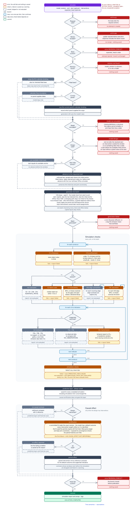

# Action flowcharts

What one call to each [scientific action](scientific-actions.md) does, from request to commit. The [Bayesian workflow](../assets/bayesian-workflow.svg) shows how calls follow one another, and the [check catalog](model-checks.md) defines each check.

Besides the failures each chart lists, any call fails without saving when its request is invalid (HTTP `422`, before an attempt starts), when the branch moves before the commit, or on an unexpected error.

## edit_model



## prepare_data



## fit



## simulate



## Updating the charts

The detailed `edit_model` chart is maintained as a native Excalidraw scene beside
its exported SVG. Preserve its individual check nodes when editing it. The other
three charts use Mermaid sources converted to editable native Excalidraw elements
with the globally installed `excalidraw-mermaid` tool:

```bash
for action in prepare-data fit simulate; do
  excalidraw-mermaid --force --require-native --svg "docs/assets/action-flows/$action.svg" \
    "docs/assets/action-flows/$action.mmd" "docs/assets/action-flows/$action.excalidraw"
done
```

Render and inspect the exported SVGs after changes. Regeneration replaces manual
scene edits for the three Mermaid-derived charts.
