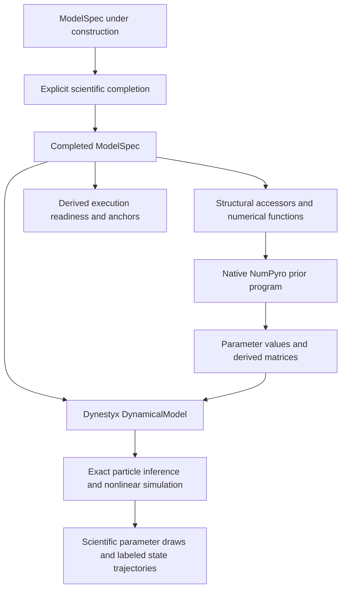

# Model Compilation

The compiler consumes a completed [ModelSpec](../pipeline/latent-structure.md#modelspec). The same scientific entities already contain their likelihoods, additive mechanisms, coefficient slots, native priors, and defaults. Compilation derives execution details and rejects missing scientific choices.

## Key Data Types

| Type | Defined in | Purpose |
|---|---|---|
| [ModelSpec](../pipeline/latent-structure.md#modelspec) | `artifacts/model_spec.py` | The only scientific model definition, enriched across authoring and conditioning stages |
| `SiteDescriptor` | `models/ssm/structure/sites.py` | Ephemeral native sample-site shape, support, and quantity |
| `NumPyroDistribution` | `numpyro_json.py` | Serialization of native scientific distributions |
| [`ExecutionReadiness`](../../apps/data-pipeline/src/nof1_causal_lab/artifacts/execution.py) | `artifacts/execution.py` | Unmet execution requirements or anchor certificates, derived from the selected ModelSpec |
| `PriorRuntimeBundle` | `models/ssm/parameterization.py` | Derived site registry and native prior distributions |
| `DynamicalModel` | Dynestyx | Executable initial distribution, state evolution, and observation model |

## Scientific Completion

[Component completion](../../apps/data-pipeline/src/nof1_causal_lab/models/parameter_planning.py) attaches explicit innovation, initial-state, and likelihood coefficients before compilation. Authoring options become concrete fixed values or parameter references on those components. Prior completion fills unassigned laws at this explicit authoring boundary; rationale and evidence remain in authoring logs.

The compiler neither invents parameters nor fills absent priors. Native support and array attachment belong to execution metadata; the scientific parameter records its native law or fixed value and any authoring-scale transformation. Its meaning and relationships are derived from the component slots that reference it.

## Structural Derivation

[ModelSpec accessors](../../apps/data-pipeline/src/nof1_causal_lab/artifacts/model_spec.py) derive retained state and observation order, reference indicators, known inputs, and induced dependencies directly from canonical entities. Retained edges and known inputs are the original values. [Structural functions](../../apps/data-pipeline/src/nof1_causal_lab/models/model_structure.py) validate executable capabilities and explain the disposition of each source entity. These results are computed from the model revision and are not persisted as another specification.

Construct admission derives a scoped ModelSpec for its cumulative set of admitted constructs. The same compiler then validates that candidate without a second topology argument.

Compilation checks that mechanisms cover the retained states and edges, and that every parameter reference resolves. Prior validation belongs to statistical authoring and runtime input construction. Anchor certificates require location and scale identification for each retained state. Several declared mechanisms may contribute to one edge. Turning an edge off targets all its contributions.

## Numerical Derivation

[Functions over ModelSpec](../../apps/data-pipeline/src/nof1_causal_lab/models/ssm/numerics.py) derive state and observation order, numerical supports, loading and covariance blocks, and vector-field components. Construct, edge, and mechanism IDs determine targets and coefficient ownership. Renaming or reordering terms cannot exchange their parameters.

Likelihood families, links, levels, and standardization come from owned indicators and likelihoods. Known-input sources, scales, missing-value policies, and lag semantics come from construct usage and edges. Numerical arrays are computed when execution needs them; they are not a second stored specification.

Known-input effects currently support one linear contribution per input/state cell. State edges compose [scalar expressions](../pipeline/statistical-model-spec.md#dynamicsmechanism), including linear effects, Hill responses, moderation, and multiple independent coefficients with the same scientific role. Unsupported combinations fail explicitly.

## Parameter Binding

`build_semantic_prior_bindings()` follows coefficient references on mechanisms, likelihoods, innovations, and initial states. A [derived reverse index](../../apps/data-pipeline/src/nof1_causal_lab/models/model_parameters.py) supplies each use's numerical role and entity IDs. `ParameterSpec` stores neither a quantity tag nor an owner list. A coefficient is a fixed literal or a reference to a parameter with a native prior or fixed model-scale `value`.

Measurement cross-loadings name the additional construct explicitly. Innovation dependencies retain conditional noise loadings; initial-state dependencies retain correlations. Shared family parameters have one definition referenced by all applicable likelihoods. These relationships are not inferred from parameter names.

Bindings are ephemeral results of a function. Conditioning stores a shared native joint law on ModelSpec, with members derived from parameter and construct references. Analysis derives numerical coordinates from that exact ModelSpec revision. Joint-law identities include semantic element identities, so a changed covariance basis cannot silently reinterpret retained draws. Compiler coordinate maps and numerical templates are not persisted.

## Native Prior Laws

NumPyro owns argument constraints, densities, sampling, and transform Jacobians. The [native JSON codec](../../apps/data-pipeline/src/nof1_causal_lab/numpyro_json.py) persists constructor trees, including batch and event dimensions. ModelSpec can hold individual native laws or references to a shared joint law. The current input-prior compiler binds scalar coordinate laws; retained particle posteriors use a shared joint law and are read directly without rebuilding independent marginals.

Persistence priors become continuous-time decay through `decay = −log(persistence) / interval`. This is an exact native transformed distribution, including its density Jacobian. There is no Gamma approximation. The entire authored persistence support must lie within the supported interval; an unbounded Normal or point mass is rejected.

Interval effects are rescaled with a native affine transform. Their positive interval comes from `reference_interval_days`, the edge lag, or ModelSpec's measurement clock. Missing interval evidence is an error.

The [coordinate assembler](../../apps/data-pipeline/src/nof1_causal_lab/prior_distributions.py) batches matching NumPyro parameter trees and uses a masked deterministic selector for differing trees. Coordinates in the same native array can retain different prescribed distribution families.

Native laws remain on ModelSpec. Runtime construction derives their transformed site laws from that exact value.

## Execution Readiness

[`ModelSpec.execution_readiness`](../../apps/data-pipeline/src/nof1_causal_lab/models/model_checks.py) derives unmet requirements for an incomplete model or anchor certificates for an executable model. Invalid executable choices raise an error. The [model snapshot](../design/model-snapshot.md) exposes this evidence as `findings.execution`, sourced to the selected model revision. No compilation receipt is persisted.

`ModelSpec.check_execution()` requires completeness and validates structural coverage, measurement semantics, numerical capabilities, parameter bindings, and latent anchors. Model writes run these checks within their atomic commit. Inference checks its pinned input model before computation, and simulation checks the conditioned model it reads. Readiness establishes executable completeness; [causal identification](../pipeline/measurement-structure.md#identificationreport) and [prior-predictive admission](../pipeline/statistical-model-spec.md#outputs) remain independently sourced findings with their own inputs.

## Compile Diagnostics

Authoring logs retain prior validation findings. First-order scale diagnostics compare deterministic reference values with a full matrix logarithm. These reference values are diagnostic anchors; transforming a base-law mean does not make it the transformed-law mean.

Compile diagnostics do not replace the inference model, calculate a posterior, or authorize a causal claim. Scientific identification remains a separately sourced [finding](../pipeline/measurement-structure.md#identificationreport).

## Runtime and Exactness

`prepare_model_runtime(model_spec=...)` validates observations against declared indicator levels and support, then prepares observations, times, and known inputs. [build_dynamical_model](../../apps/data-pipeline/src/nof1_causal_lab/models/ssm/execution/dynamical_model.py) consumes the ModelSpec and one parameter draw to construct Dynestyx's `DynamicalModel`.

The expression compiler emits additive drift terms and node potentials into Dynestyx's native state evolution. Dynestyx computes each potential's negative gradient. Directed-edge ownership and hard-intervention semantics remain in the [causal adapter](../../apps/data-pipeline/src/nof1_causal_lab/models/ssm/dynamics/vector_field.py); a clamped node loses its natural drift, potential force, and process noise.

Inference and [prior/posterior prediction](../../apps/data-pipeline/src/nof1_causal_lab/models/ssm/predictive/registry_runtime.py) use this same model constructor. Prediction samples its declared initial and observation distributions. The [Gaussian emission density](../../apps/data-pipeline/src/nof1_causal_lab/models/ssm/execution/emissions.py) uses Dynestyx's exact missing-data marginalization over observed coordinates, including correlated channels and wholly missing rows.

Production posterior sampling and reported diagnostics use the exact particle engines over the true emission density. Latent transitions use Euler–Maruyama over the nonlinear drift; forward simulation uses Diffrax integration. Time discretization remains an explicit numerical approximation.

Laplace, IEKS, and Gaussian approximations may initialize particle samplers only. Their proposals and initial positions are corrected by the exact inference engine. The [initialization boundary guard](../../apps/data-pipeline/tests/models/ssm/test_linearization_init_only.py) prevents a linearized surrogate from entering a reported result path.
