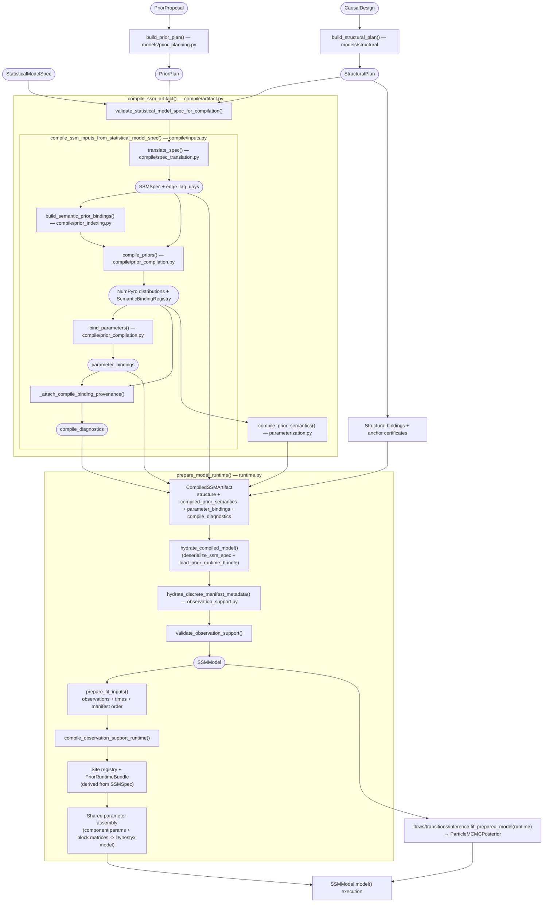
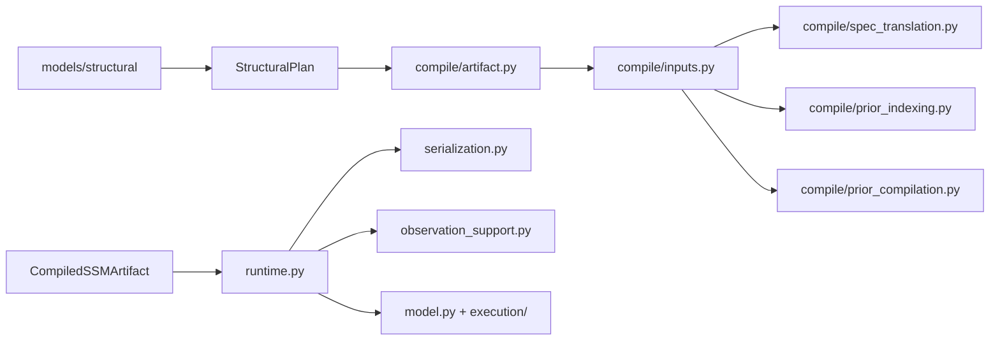

# SSM Compilation Pipeline

The structural front first translates a scientific [`CausalDesign`](../pipeline/measurement-structure.md#causaldesign) into a versioned [`StructuralPlan`](../pipeline/measurement-structure.md#structuralplan). The application projects evidence-rich `PriorProposal` rows into a typed `PriorPlan`. The SSM compiler then consumes only the [`StatisticalModelSpec`](../pipeline/statistical-model-spec.md#statisticalmodelspec), `PriorPlan`, and `StructuralPlan`, producing a `CompiledSSMArtifact` for the [`posterior` transition](../pipeline/inference.md).



## Key Data Types

| Type | Defined in | Purpose |
|------|-----------|---------|
| [`StatisticalModelSpec`](../pipeline/statistical-model-spec.md#statisticalmodelspec) | `artifacts/statistical_model_spec.py` | User-facing statistical model spec: parameters, likelihoods, roles |
| [`CausalDesign`](../pipeline/measurement-structure.md#causaldesign) | `artifacts/causal_design.py` | Scientific DAG, measurement semantics, and authored executable dispositions |
| [`StructuralPlan`](../pipeline/measurement-structure.md#structuralplan) | `artifacts/structural_plan.py` | Versioned executable structure and semantic catalog keyed by stable source IDs |
| `PriorPlan` | `artifacts/prior.py` | Complete, family-validated executable priors keyed exactly to `StatisticalModelSpec` parameters |
| `SSMSpec` | `models/ssm/model.py` | SSM artifact: dimensions, names, distributions, structure blocks, and composite drift spec |
| `SiteDescriptor` | `models/ssm/structure/sites.py` | Canonical sample-site identity: name, shape, support, semantic kind, assembly group, and prior binding field |
| `dict[str, numpyro.distributions.Distribution]` | `models/ssm/priors.py` | Native laws keyed by sample site, shared by inference and prior prediction |
| `CompiledDistribution` | `artifacts/distribution.py` | Scalar JSON recipe containing an approved family, its strict parameters, and its declared transforms |
| `PriorRuntimeBundle` | `models/ssm/parameterization.py` | Runtime site registry and native NumPyro distributions reconstructed without model tracing |
| `SemanticBindingRegistry` | `models/ssm/compile/prior_indexing.py` | Parameter-ID registry of compiled sample-site coordinates |
| `CompiledStructure` | `artifacts/compiled_ssm.py` | Serialized SSM structure, source bindings, edge lags, and identification-anchor certificates |
| `CompiledSSMArtifact` | `artifacts/compiled_ssm.py` | Serializable bundle: compiled structure + compiled prior semantics + parameter bindings + diagnostics |
| `SSMModel` | `models/ssm/model.py` | Executable NumPyro generative model |
| `ParticleMCMCPosterior` | `models/ssm/inference/types.py` | Production particle-MCMC samples, diagnostics, and engine evidence |
| `WarmupProposal` | `models/ssm/inference/types.py` | Laplace/IEKS initialization draws and proposal preconditioning only |

## Stage 0: Structural Planning (`models/structural/`)

`build_structural_plan()` normalizes the authoring artifacts once. It assigns stable source IDs, carries construct/edge/indicator semantics into one catalog, orders retained states and manifests, selects each retained state's reference indicator, compiles known inputs and induced dependencies, and records an explicit disposition for every source item. Unsupported static-target edges and incomplete executable coverage fail here rather than being silently dropped.

The compiler's separate `compile/structural/closure.py` pass binds every retained structural item to its runtime target and rejects either direction of mismatch. Its anchor pass certifies one location anchor and one scale anchor for every retained latent. The compiler consumes the completed plan and never calls the structural planner or identification utilities.

## Stage 1: Spec Translation (`compile/spec_translation.py`)

Converts a `StatisticalModelSpec` + `StructuralPlan` into an `SSMSpec` — the artifact that persists concrete numeric templates, structure blocks, and the composite drift spec.

**What it does:**

- Extracts latent construct layout from the structural plan (names, order, time-invariant mask)
- Lowers the declared [scientific mechanisms](../pipeline/statistical-model-spec.md#dynamicsmechanism) to native vector-field components. Construct and edge IDs select the targets; coefficient slots select fixed values or estimated parameters. Labels do not select model structure.
- Builds the **loading template** (`lambda_mat`) plus `lambda_mask`: fixed indicator-to-construct loadings and free non-reference loadings
- Compiles concrete templates plus masks for `cint`, `static_state_sds`, `diffusion_chol`, `manifest_means`, `manifest_chol`, `t0_means`, and `t0_chol`.
- Converts marginalized time-invariant confounders into compiled low-rank baseline factors of the form `B diag(tau^2) B^T` rather than free pairwise `cor0_*` surfaces
- Derives deterministic `manifest_standardized` flags from the locked likelihood family, link, and observation support semantics
- Applies initial-state and observation-intercept policies. A mechanism declares its own centre or constant forcing; the compiler checks the required identification anchors.
- Computes **edge_lag_days**: for each cross-lag edge, the lag in days (used by prior compilation to scale DT→CT)
- Selects observation distribution families from `measurement_dtype`
- Eliminates legacy string matrix modes: translation always emits concrete templates and explicit masks

**Key function:** `translate_spec(statistical_model_spec, structural_plan) -> (SSMSpec, edge_lag_days)`

## `measurements` transition: Semantic Prior Bindings (`compile/prior_indexing.py`)

Binds scientific parameter IDs to canonical sample-site indices using their quantities, explicit owners, and the native structure's ID-labelled axes.

**What it does:**

- Reads each parameter's declared quantity, owners, and prior-authoring transform
- Maps it to the correct SSM site (`vf_0_decay`, `vf_2_weight`, `lambda_free`, `manifest_means_free`, `static_state_sd_free`, etc.) and flat index
- Derives the canonical free-entry order from block and dynamics `SiteDescriptor`s so the compiler, runtime assembly, and posterior name resolution all share one site registry.
- Checks directed edge IDs, so opposite feedback edges remain distinct even though they share endpoints. Renaming or duplicating parameter display labels leaves bindings unchanged.

**Key function:** `build_semantic_prior_bindings(ssm_spec, statistical_model_spec, *, structural_plan=None) -> SemanticBindingRegistry`

This is now a strict internal helper: it requires both a translated `SSMSpec` and a semantic `StatisticalModelSpec`. Spec-only entrypoints decide explicitly when no semantic bindings should be produced; the indexer no longer falls back to all-empty maps.

**Returns:** a `SemanticBindingRegistry` with parameter-ID-keyed `by_parameter` entries. Each binding records the parameter's site kind, canonical site name, and flat index. Bindings span the full set of site categories:

- cross-lag effects (drift off-diagonal) and factor loadings
- AR coefficients (baseline decay for the derived drift diagonal)
- residual SDs and residual correlations
- transition input-effect entries
- initial-state means, standard deviations, and correlations
- manifest intercepts and manifest noise terms
- continuous-time state intercepts
- compiled baseline-factor scales (static state SDs)
- observation-family hyperparameter sites

## `validation_report` derivation: Prior Compilation (`compile/prior_compilation.py`)

Translates a complete typed `PriorPlan` into site-keyed NumPyro distributions with the correct parameterization. Evidence, citations, and agent-facing rationales stay in `PriorProposal`; only family-validated executable fields cross the compiler boundary.

**Critical transformations:**

- **AR coefficients (DT→CT):** User specifies `rho_*` as baseline persistence in `(0, 1)` over the authored interval, absent incoming feedback. The compiler transforms it to positive continuous-time base decay with `base_decay = −log(rho) / dt`; NumPyro applies this change of variables to the complete authored law with its exact density Jacobian. Persistence priors must have their entire support within `[0, 1]`, such as Beta, Uniform, or TruncatedNormal with valid bounds. Unbounded Normal and authored point-mass priors are rejected. There is no Gamma approximation.
- **Hard-sparsity drift assembly:** Off-diagonal entries are compiled as `A_ij = beta_ij / dt` on allowed edges only. For each dynamic row, the realised diagonal is derived as `A_ii = -(base_decay_i + sum_j |A_ij| + stability_margin)`, preserving structural zeros while guaranteeing strict row diagonal dominance.
- **Cross-lag effects:** The complete distribution is rescaled by a native affine transform, preserving its family and bounds. The positive interval is resolved in this order: `reference_interval_days`, then compiled `edge_lag_days`, then the structural-plan model clock. If none exists, compilation raises instead of silently assuming `1.0d`.
- **Site binding:** compiled priors attach to canonical `SiteDescriptor`s. Structure blocks and dynamics components use the same prior materialization path.

Authored proposals, executable priors, and compiled recipes share [`DistributionSpec`](../../apps/data-pipeline/src/nof1_causal_lab/artifacts/distribution.py): the family and its complete numeric arguments are validated together by NumPyro. Its JSON schema derives inline family-specific signatures from native argument metadata, without separate parameter classes. The application retains family approval, scientific domains, parameter ownership, and evidence. NumPyro owns argument constraints, distribution moments, densities, sampling, and transform Jacobians. Nonlinear transformed reference values used by compile diagnostics are anchors, not claims about the transformed distribution's mean.

**Public boundary:** `compile_ssm_inputs_from_statistical_model_spec(statistical_model_spec, prior_plan, structural_plan=...)`. The internal `compile_priors()` helper receives compiler payloads projected from the plan.

**Post-compilation diagnostics:**

- `collect_interval_provenance_warnings()` — warns when cited source intervals and authored/model intervals materially disagree
- `collect_first_order_approximation_warnings()` — uses deterministic reference values (the base-law mean passed through the declared transforms) and the full matrix logarithm `logm(A_dt) / dt` to flag cross-lag priors whose elementwise `beta_dt / dt` CT coupling materially differs from the full-system CT scale
- `collect_compile_diagnostics()` — combines these warnings into the structured diagnostics payload persisted on the artifact

## `statistical_model_spec` transition: Parameter Bindings (`compile/prior_compilation.py`)

Creates the mapping from scientific parameter IDs to NumPyro sample sites — the bridge between the statistical model specification and posterior extraction.

**Key function:** `bind_parameters(index_maps) -> list[dict]`

Each binding references a parameter ID, its logical element ID, the native site name, and the coordinate within that site.

This allows `ParticleMCMCPosterior` to map posterior samples back to user-facing parameter names. `bind_parameters()` consumes the already-compiled `SemanticBindingRegistry` from `validation_report` derivation rather than rebuilding it, and only the compile entrypoints decide whether semantic bindings should exist at all.

## Stage 5: Artifact Serialization (`compile/artifact.py`)

Bundles everything into a `CompiledSSMArtifact` — a JSON-serializable dict that can be persisted to disk and reconstructed later without re-running compilation.

```python
CompiledSSMArtifact = {
    "schema_version": 2,
    "structure": {
        "spec": {...},                  # SSMSpec as dict
        "edge_lag_days": [...],         # source-bound lag metadata
        "bindings": [...],              # StructuralPlan source ID → runtime target
        "anchor_certificates": [...],   # per-latent location/scale proof
    },
    "compiled_prior_semantics": {...},  # serialized PriorRuntimeBundle payload
    "parameter_bindings": [...],        # scientific parameter IDs → NumPyro coordinates
    "compile_diagnostics": [...],       # compile-time warnings / notes
}
```

The artifact stores `compiled_prior_semantics`, the canonical runtime prior block used to reconstruct `PriorRuntimeBundle` without retracing the model. Its [version 7 contract](../../apps/data-pipeline/src/nof1_causal_lab/artifacts/compiled_ssm.py) stores site metadata and a list of scalar distribution recipes per site. Runtime hydration constructs native NumPyro distributions from these recipes; there are no integer family tags or parallel numeric prior-state arrays. NumPyro owns inference coordinate transforms; prior prediction samples the distributions directly. Earlier compiled-prior versions require recompilation.

Also provides validation entry points used by earlier pipeline transitions:

- `validate_statistical_model_spec_for_compilation()` — catches structural errors before committing to compilation
- `trial_compile_statistical_model_spec()` / `trial_compile_measurement_structure()` — dry-run compilation that returns an error string or None

Observation likelihoods and predictive draws share the native laws in [`observation_distributions.py`](../../apps/data-pipeline/src/nof1_causal_lab/models/ssm/execution/observation_distributions.py). Beta shape parameters and negative-binomial rates have no sampler-only floors. Binary boundary probabilities and zero-mean count distributions retain their exact limiting laws. The application still owns links, aggregation windows, measurement support, covariance structure, and missing measurements. Changing to native samplers preserves these laws but does not promise identical draws for historical random seeds.

## Stage 5: Runtime Preparation (`runtime.py`, `serialization.py`, `observation_support.py`)

`hydrate_compiled_model()` in `runtime.py` reconstructs the compiled artifact into a live `SSMModel`. Deserialization lives in `serialization.py`; compilation never calls runtime hydration, and runtime never calls compiler implementation code.

**`observation_support.py`** handles data-dependent hydration:

- `hydrate_discrete_manifest_metadata()` — infers level counts for categorical/ordinal emissions from observed data
- `validate_observation_support()` — checks no values fall outside the observation family's support (e.g., negative values for Poisson)

**`runtime.py`** provides the runtime API:

- `build_ssm_model(wide_data, ssm_spec=..., ...)` → `SSMModel` — materializes the NumPyro model from an already compiled `SSMSpec`
- `hydrate_compiled_model(compiled_ssm, wide_data)` → `SSMModel` — reconstructs a persisted artifact and delegates model construction
- `prepare_model_runtime(data_for_model, ...)` → `PreparedModelRuntime` — prepares observations, times, observation support, transition inputs, and sampler config
- `sample_prior_predictive(model, ...)` — generates prior predictive samples for validation

The application-owned `flows/transitions/inference/fit.py` adapter applies sampler configuration and routes a `PreparedModelRuntime` into `inference.fit()`. Runtime hydration therefore has no dependency on inference algorithms.

Runtime reconstruction now has three layers:

- **`SSMSpec`** remains the serialization and validation boundary. It owns persisted templates, masks, distributions, names, and the composite drift spec.
- **`PriorRuntimeBundle`** is rebuilt from `compiled_prior_semantics` and owns the sample-site registry and native prior distributions.
- **`RuntimeDynamics`** is sampled through the compiled composite drift spec. Inference backends then derive affine or local-linear views from the vector field instead of splitting linear vs nonlinear at the spec level.

**Why `fit()` stays outside `SSMModel`:** the runtime separates three concerns:

- **`SSMModel`** is a pure NumPyro model function. Its [`model(observations, times)`](estimation.md#data-flow) method takes JAX arrays, samples from the runtime prior bundle, assembles block deterministic values plus `RuntimeDynamics`, and injects the log-likelihood via `numpyro.factor()`. It has no knowledge of DataFrames, inference algorithms, or sampler configuration.
- **`inference.fit()`** handles [algorithm selection](inference-routing.md) and execution. It takes an `SSMModel` and prepared arrays.
- **`PreparedModelRuntime`** bridges the gap: it carries the `SSMModel`, prepared JAX arrays, observation-support runtime, transition inputs, manifest order, sampler config, and inference-structure plan for Stage 5 diagnostics.
- Before array conversion, `prepare_fit_inputs()` applies deterministic standardization to manifest columns whose compiled `manifest_standardized` flag is `True`, so standardized additive-location indicators arrive with mean 0 and sd 1 consistently in both fitting and prior-predictive scale checks.

Moving `fit()` onto `SSMModel` would couple it to DataFrame handling and sampler config routing — concerns that belong to the orchestrator layer, not the probabilistic model.

**Two model-construction entry points:**

- `hydrate_compiled_model(compiled_ssm, wide_data)` in `runtime.py` — deserializes a persisted `CompiledSSMArtifact`, rebuilds the prior runtime bundle from `compiled_prior_semantics`, hydrates observation metadata from wide data, and returns an `SSMModel`. This is the pipeline path because Stage 5 consumes the artifact that the `statistical_model_spec` transition persisted.
- `build_ssm_model(wide_data, ssm_spec=..., prior_registry=...)` in `runtime.py` — builds from an already translated `SSMSpec`. It never invokes the compiler.

Both return a live `SSMModel`. Callers that need fit-ready arrays use `prepare_model_runtime()` or `prepare_wide_model_runtime()` to construct a `PreparedModelRuntime`.

## File Dependency Graph



The compiler and runtime subgraphs meet through serialized data, not calls in both directions. `scripts/check_architecture_boundaries.py` enforces this direction along with the StructuralPlan, PriorPlan, and execution/inference boundaries. The compilation orchestrator (`compile/inputs.py`) exposes `compile_ssm_inputs_from_statistical_model_spec()` for the semantic `statistical_model_spec` transition path. Already translated `SSMSpec` callers go directly to runtime construction because they have nothing left to compile.
