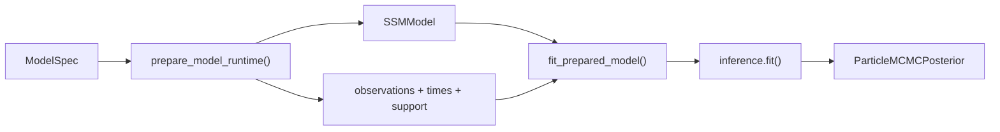

# Estimation Pipeline

This document describes execution from a completed [ModelSpec](../pipeline/latent-structure.md#modelspec). [Numerical functions](compilation.md#numerical-derivation) derive native priors and matrices, and construct Dynestyx's `DynamicalModel`. For inference strategy selection, see [inference routing](inference-routing.md).

**Reader guide:**

- **Sections 1–3** are math: the continuous-time SDE that the model encodes, how the exact execution layer discretizes it per observation interval, and how inference targets that executable model.
- **Section 4** is runtime: the library stack (JAX / NumPyro / cuthbert) and the data flow from compiled artifact through fitting to `ParticleMCMCPosterior`.

## 1. CT-SDE Formulation

The latent process is a continuous-time stochastic differential equation with a composite **vector-field** drift and additive Gaussian diffusion:

```text
d eta(t) = f(eta(t), t; theta) dt + G dW(t)
```

where:

- `f` is the **drift vector field**, assembled as a sum of components: per-construct baseline decay and intercepts plus per-edge effects. Edges are drawn from a small vocabulary — **linear** (baseline coupling), **Hill** (saturating dose-response), and **multiplicative** (bilinear interaction) — so the dynamics are non-linear in general. The affine CT-SEM form `f(eta) = A * eta + c`[^sarkka2019] is the constant-Jacobian special case (a single dense-linear component), recovered exactly when every edge is linear.
- In the affine case `A` is the `n_latent x n_latent` **drift matrix** controlling auto- and cross-regressive dynamics: off-diagonal entries (cross-effects) are sampled on allowed edges, and diagonal entries are derived from baseline decay plus incoming row mass so each dynamic row is strictly damped. For non-linear edges the relevant first-order object is the **Jacobian** `∂f/∂eta`, which drives discretization (§2) and the local stability check.
- `c` is the `n_latent x 1` **continuous intercept** (CINT), shifting the asymptotic mean away from zero (the affine intercept; the local intercept `f(x_lin) - (∂f/∂eta) x_lin` in general).
- `G` is the `n_latent x n_latent` **diffusion Cholesky factor**, so `G G'` is the process noise covariance; diffusion is additive Gaussian regardless of the drift.
- `W(t)` is a standard Wiener process.

The observation (measurement) model is:

```text
y(t) = Lambda * eta(t) + mu + epsilon,    epsilon ~ F(0, R)
```

where:

- `Lambda` is the `n_manifest x n_latent` **factor loading matrix** mapping latent states to observed indicators.
- `mu` is the `n_manifest x 1` **manifest intercept**.
- `R` is the `n_manifest x n_manifest` **measurement error covariance** (Cholesky-parameterized internally).
- `F` is the [observation noise family](statistical-model-spec/likelihoods.md#distribution-families) with its associated [link function](statistical-model-spec/likelihoods.md#link-functions). Gaussian (identity link) by default; see the [dtype-to-distribution mapping](statistical-model-spec/likelihoods.md#dtype-to-distribution-mapping) for all supported families.

## 2. Exact Execution (CT to DT)

Observations arrive at discrete, potentially irregular times. The reported posterior uses Euler–Maruyama transitions evaluated against the true nonlinear vector field at each path state:

```text
eta_t = eta_(t-1) + dt_t * f(eta_(t-1), t; theta)
        + G * sqrt(dt_t) * epsilon_t
epsilon_t ~ Normal(0, I)
```

For additive diffusion covariance `Q_c = G G'`, the transition density is therefore:

```text
eta_t | eta_(t-1) ~ Normal(
    eta_(t-1) + dt_t * f(eta_(t-1), t; theta),
    Q_c * dt_t,
)
```

This is the only latent transition target exposed by `SSMModel.trajectory_target()`. Its implementation lives in `models/ssm/execution/`, independent of sampler algorithms. The particle methods consume that contract and evaluate the true emission density; the remaining approximation is the controllable time-discretization error from `dt`, not a linearized model substitution.

### Initialization-only linearization

IEKS/Laplace and local affine discretization are confined to warmup: initial parameter positions, proposal preconditioning, and the cSMC reference trajectory. Exact MCMC/SMC correction prevents those initializers from replacing the stationary target. `test_linearization_init_only.py` statically guards this ownership.

**Note on `edge_lag_days`:** The per-edge lag in days, computed during [spec translation in the compilation pipeline](compilation.md#stage-1-spec-translation-compilespec_translationpy), is used by prior compilation to scale DT-to-CT effects consistently with the discretization interval.

## 3. State-Side Objectives

The IEKS/Laplace machinery supplies initialization and corrected proposal components. It does not replace the reported posterior target. The `marginal_particle_gibbs` method updates latent trajectories with dSMC against the true nonlinear drift and emission density. The routing details live in [inference-routing.md](inference-routing.md).

### IEKS/Laplace backend

Approximate marginal likelihood for non-Gaussian observation models and support-aware interval summaries. It finds a latent trajectory mode with an Iterated Extended Kalman Smoother, then applies a Laplace correction around that mode.

**Applicable when:** The compiled model uses the CT-SDE latent dynamics.

**Complexity:** O(T n^3) for point observations, with profile-banded solvers for interval-summary support.

### Method-specific inner objectives

Some method internals do not use only the generic `models/likelihoods` package as their inner objective:

- The **`marginal_particle_gibbs`** dSMC smoother updates latent trajectories as part of the collapsed Particle Gibbs sweep. Its `amala_exact` and `paid_mix` leaves are exactly corrected, so proposal approximations do not replace the true target.

### Missing data handling

Missing observations are handled by masking: an observation mask (`~isnan`) drops the per-channel likelihood contribution of unobserved entries, so the smoother conditions only on the observed channels.

## 4. Library Stack

The estimation pipeline composes three main libraries:

- **JAX**: Foundation layer. Array operations, matrix exponentials for discretization, vmap for batching, automatic differentiation for gradient-based inference, `lax.scan` for sequential filtering, `checkpoint` for memory-efficient backpropagation through long time series.

- **NumPyro**: Probabilistic programming layer. `sample()` for priors, `factor()` for custom log-likelihoods, and `deterministic()` for derived quantities.

- **cuthbert**: Differentiable filtering library used by the auxiliary Kalman trajectory machinery.

### Data flow



`prepare_model_runtime(model_spec=...)` reads the pinned scientific definition, derives native priors and numerical blocks, validates observation support, and prepares JAX observations, times, and inputs. `fit_prepared_model()` passes that execution context to particle inference. The returned `ParticleMCMCPosterior` carries production-engine evidence, parameter samples, trajectories, and diagnostics. Persistence converts parameter samples to scientific element IDs and labels the state axis. The fitted artifact keeps its exact ModelSpec revision in provenance. Laplace/IEKS produces a distinct `WarmupProposal` that cannot enter reported-posterior APIs.

Post-estimation causal effect computation, intervention semantics, and interpretation guidance live in [`baseline_report` transition](../pipeline/analysis.md).

[^sarkka2019]: Särkkä, S., & Solin, A. (2019). *Applied Stochastic Differential Equations*. Cambridge University Press. [Bibliography entry](bibliography.md)
