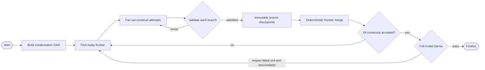

# Model-Spec Construct-Admission State Machine

The `statistical_model_spec` transition is a deterministic, topology-aware construct-admission state machine wrapped in Temporal. There is one production path and no mode toggle.

## What the State Machine Owns

The state machine translates the current [`model`](../../pipeline/latent-structure.md#modelspec), [`panel`](../../pipeline/extraction.md), and [`validation_report`](../../pipeline/extraction-validation.md) into one complete statistical model and prior system.

| State | Meaning |
|---|---|
| Admission units | Strongly connected components of the estimation graph, ordered as a condensation DAG |
| Accepted constructs | Dependency-closed set of contributions that passed admission |
| Ready frontier | Units whose predecessor units are fully accepted |
| Attempts | Current LLM attempt for each construct in the ready frontier |
| Checkpoint reference | Immutable file-backed snapshot of the latest merged accepted state |
| Search state | Literature queries and cached results accumulated by the run |

The LLM does not own the topology, parameter inventory, causal edges, or validation result. Each child subroutine proposes only its construct's allowed likelihood choices, priors, and explicit rationales for accepted soft consequences.

## Nominal Transition

Planning builds the compiler-authoritative parameter catalog and condenses the estimation graph into a DAG of admission units. Every ready singleton unit launches concurrently. Members of a lagged feedback component remain sequential in retained-state order because each member can change the subsystem validated by the next member.

Each construct attempt gets a fresh LLM subroutine. The required `submit_construct` call contains:

- the active construct name;
- its indicator likelihood and link choices;
- priors keyed by canonical parameter name; and
- optional target-scoped acceptance objects containing the exact failing soft-check identifier,
  target, and written rationale.

The transition allows at most four attempts per construct. Ending an attempt without `submit_construct`, or exhausting all attempts without admission, fails the transition.

## Admission Semantics

A submission is first restricted to the active construct's compiler-authoritative surface. Unknown or non-free parameters are rejected. Parameters sharing a pooled compiler site must use one prior family.

The cumulative partial model then compiles against the causal design restricted to the immutable accepted frontier plus the proposed construct. Parallel siblings validate against the same frontier snapshot, so neither can observe an unmerged sibling. Prior-predictive trajectories are generated through the true nonlinear drift and emission densities. The reachability battery evaluates numerical health, marginal latent scale, family-specific replicated-data discrepancies, construct-specific irregular-schedule resolvability, per-edge influence, and draw-paired nonlinear saturation where applicable. Closing a feedback component tentatively rechecks every affected member; any hard failure rejects the closing submission before state is committed.

| Finding | Effect |
|---|---|
| Hard check fails | Construct remains active and must be revised |
| Soft check fails without rationale | Construct remains active for revision or explicit acceptance |
| Soft check fails with accepted rationale | Consequence is recorded and the construct may be admitted |
| All applicable checks pass | Construct is admitted |

Admission is cumulative and dependency-aware. As branches finish, one merge activity deterministically adds their immutable child checkpoints to the current master. A newly ready descendant can start immediately while unrelated branches keep running. A join construct becomes ready only after every predecessor unit is accepted.

After every construct is accepted, a full-model barrier compiles once, draws one exact prior-predictive sample set, and runs every construct's battery against that shared model. A failed construct reopens its admission unit from the failing member onward plus every descendant unit; independent accepted branches remain intact.

## Immutable Success Checkpoints

Every admitted construct creates an immutable branch checkpoint. As completions arrive, one deterministic merge creates the next master checkpoint. A branch may have started from an earlier master snapshot; the merge verifies that its inherited accepted state is an unchanged subset of the current master and that it adds exactly one construct. A checkpoint contains semantic reducer state only:

- exact input artifact-version pins;
- accepted construct submissions and annotations;
- literature search state;
- target-scoped repair feedback and the full-model barrier status;
- checkpoint ancestry; and
- submission identifiers for accepted contributions.

Dataframes, compiler objects, and executable model objects are not serialized into checkpoints. They are reconstructed from pinned artifacts.

Checkpoints live under `data/{workspace_id}/scratch/runs/{run_id}/checkpoints/`. They are internal execution sidecars and do not enter the public artifact graph. Finalized LLM traces are instead promoted into the durable episode ledger at commit time. Inference validates [execution requirements](../compilation.md#execution-validation) before local or remote computation and rejects incomplete models.

The submission identifier determines each branch checkpoint path. If Temporal retries a tool activity after the checkpoint was written, the activity returns the existing checkpoint instead of applying the construct twice. The master checkpoint has a single writer, so parallel branches never race to overwrite accepted state.

## Failure and Outer-Orchestrator Repair

The episode workflow serializes moves. Upstream artifacts therefore cannot be edited while one `statistical_model_spec` move is still running.

When Stage 4 cannot continue, it terminates the move and records a `raised` episode-journal entry with:

- the typed failure;
- the blocked construct;
- structured diagnostics; and
- a typed resume selection containing the run id and latest checkpoint id.

The outer orchestrator can then use ordinary machine moves to revise an upstream judgment artifact or recompute stale descendants. A subsequent `run(statistical_model_spec)` starts a new Temporal child workflow and uses the checkpoint referenced by the latest raised Stage 4 move.

This preserves the framework boundary: the outer orchestrator edits artifacts; the delegated Stage 4 reducer owns its internal accepted state.

## Resume and Rebase

If the new run's input pins equal the checkpoint pins, the accepted dependency-closed set is reconstructed without rerunning its admission checks.

If any input pin changed, the transition rebases before asking the LLM to continue:

1. Rebuild the deterministic catalog and admission-unit DAG from current artifacts.
2. Replay saved contributions when their predecessor units remain valid.
3. Compile and run the same exact admission battery for each replayed contribution.
4. Retain every still-valid dependency-closed branch.
5. Reopen each invalid unit and its descendants while preserving independent branches.
6. Persist a new run-local checkpoint whose parent is the prior run's checkpoint.

Saved descendants are not trusted after an invalid contribution because their validation depended on the reopened state. Unrelated branches do not forfeit their completed work.

## Inspection

Temporal history exposes the Stage 4 workflow, one child LLM workflow per construct attempt, and their activity states. The application event stream additionally records:

| Event | Meaning |
|---|---|
| `plan` | Full admission-unit DAG and parameter surface |
| `resumed` | Source checkpoint, pin change, retained constructs, and reopened construct |
| `construct_started` | One active frontier construct and attempt |
| `construct_checking` | Admission battery is running |
| `construct_report` | Detailed check results, admission outcome, and backend phase timings |
| `barrier_report` | Full-model validation outcome and any reopened construct frontier |
| `failed` | Terminal failure and latest checkpoint reference |
| `done` | Every construct was admitted and the full-model barrier passed |

The episode timeline remains authoritative for terminal move status. Telemetry provides the finer-grained running view.

The timing breakdown separates shared work—design preparation, model compilation, and exact prior-predictive simulation—from the C1–C5 diagnostic groups, edge-off simulation, the admission decision, and any coupled subsystem recheck. A diagnostic phase lists the checks it jointly computes; shared calculations are never duplicated across individual check runtimes.

## Completion

The transition completes only when every current construct is admitted and the shared full-model barrier passes. Finalization commits the accumulated `ModelSpec` and records the [prior-predictive result](../../pipeline/statistical-model-spec.md#priorpredictiveresult), research queries, and typed validation findings in the same run's journal record. A failed final write leaves the previous model and findings current. Navigation uses successful run completion and matching inputs.
